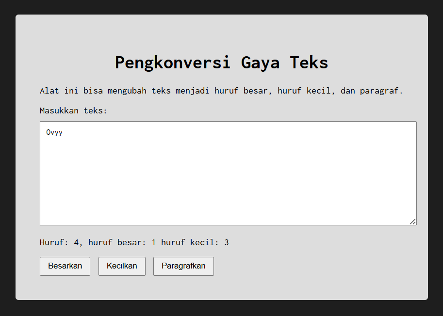

# Tugas Praktikum 03: GUI dengan HTML dan CSS

## Soal

Buatlah tata letak laman yang berada di tengah seperti pada gambar yang diberikan.
Ubah font menggunakan **Inconsolata dari Google Fonts**.

Laman harus memiliki:

* Area untuk memasukkan teks
* Informasi jumlah huruf, huruf besar, dan huruf kecil
* Tombol untuk mengubah teks menjadi huruf besar, huruf kecil, dan paragraf

## Jawaban

Saya membuat sebuah halaman web menggunakan **HTML, CSS, dan JavaScript**.
Halaman ini memiliki textarea untuk memasukkan teks, kemudian program akan menghitung jumlah huruf, huruf besar, dan huruf kecil secara otomatis saat teks diketik.

Layout halaman dibuat **berada di tengah menggunakan Flexbox**.
Font yang digunakan adalah **Inconsolata dari Google Fonts**.

Terdapat tiga tombol yaitu:

* **Besarkan** untuk mengubah teks menjadi huruf besar
* **Kecilkan** untuk mengubah teks menjadi huruf kecil
* **Paragrafkan** untuk mengubah teks menjadi paragraf

---

## Kode Sumber

index.html
style.css
script.js

## Output

---

## Deskripsi Program

Program ini merupakan sebuah halaman web sederhana yang digunakan untuk mengubah gaya teks.
Pengguna dapat memasukkan teks ke dalam textarea, kemudian program akan menghitung jumlah huruf secara otomatis.

Program juga menyediakan fitur untuk mengubah teks menjadi huruf besar, huruf kecil, dan paragraf menggunakan tombol yang tersedia.
