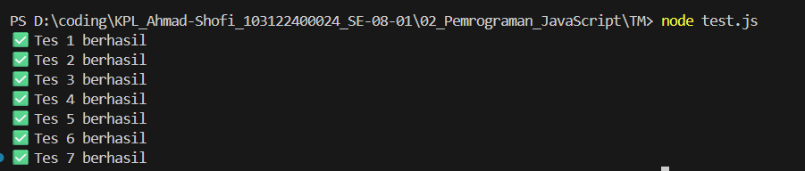

Tugas Mandiri 02: Pemrograman JavaScript

Soal
Buatlah sebuah fungsi bernama fizzBuzz yang menerima input larik (array) dan mengembalikan deretan bilangan dan "Fizz" untuk kelipatan 2, "Buzz" untuk kelipatan 7, dan "FizzBuzz" untuk kelipatan 14. Beri nama berkas program sebagai tm.js dan taruh di direktori TM

jawaban :

Saya membuat fungsi untuk mengecek setiap angka dalam array. Jika angka merupakan kelipatan 14 maka menjadi "FizzBuzz", kelipatan 2 menjadi "Fizz", dan kelipatan 7 menjadi "Buzz". Jika tidak memenuhi kondisi tersebut maka angka ditampilkan seperti biasa. Hasilnya kemudian digabungkan dengan operator += dan dipisahkan dengan spasi. Jika input bukan array, program mengembalikan "Input tidak valid".

Kode Sumber
test.js
tm.js

output

Deskripsi Program
Program ini berisi sebuah fungsi bernama fizzBuzz yang digunakan untuk memproses sebuah larik (array) berisi angka. Fungsi ini akan mengembalikan sebuah string yang berisi deretan nilai berdasarkan aturan tertentu.