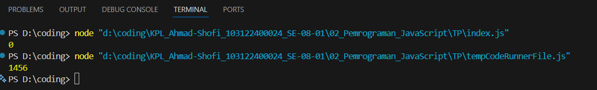

Tugas Pendahuluan 02: Pemrograman JavaScript

Soal
Kamu sudah menulis fungsi mulOfArray. Ujilah dengan input [2, 0, 26, 28, -2], dengan output yang seharusnya adalah 1456. Jika kamu menemukan bahwa hasilnya berbeda, bisakah kamu memperbaikinya? Jika kamu menemukan bahwa hasilnya sama, bisakah kamu menjelaskan mengapa demikian?

jawaban :

Awalnya saya mencoba hasil yang didapatkan adalah 0 karena kondisi arr[i] >= 0 masih memasukkan angka 0 ke dalam proses perkalian, sehingga ketika 0 dikalikan dengan angka lainnya hasil akhirnya menjadi 0, namun setelah kondisi tersebut diubah menjadi arr[i] > 0, angka 0 tidak lagi ikut dihitung dan hanya angka-angka positif saja yang dikalikan, sehingga hasil akhirnya menjadi 1456 sesuai yang diharapkan.

Kode Sumber
Tersedia di index.js

output

Deskripsi Program

Program ini digunakan untuk menghitung hasil perkalian dari angka-angka yang ada di dalam sebuah array. Di dalamnya terdapat perulangan untuk membaca setiap elemen array satu per satu, kemudian nilai tersebut dikalikan ke variabel hasil. Namun, sebelum dikalikan, ada pengecekan kondisi untuk menentukan angka mana saja yang boleh ikut dihitung.