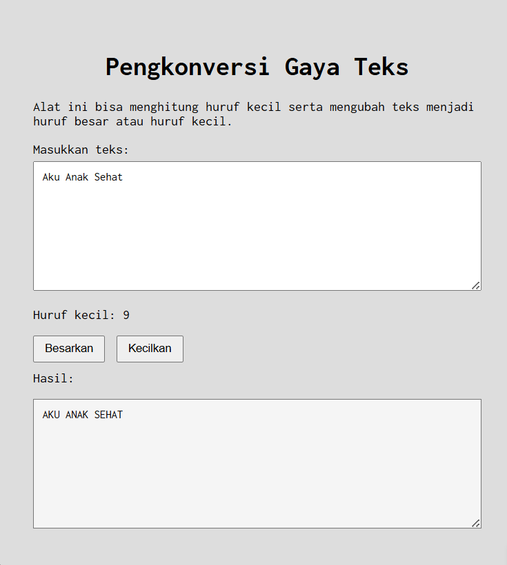

Nama: Ahmad Shofi
NIM: 103122400024
Kelas: SE-08-01

# Pengkonversi Gaya Teks

## Deskripsi Program
Program **Pengkonversi Gaya Teks** adalah aplikasi web sederhana yang dibuat menggunakan **HTML, CSS, dan JavaScript**. Program ini berfungsi untuk:

1. Menghitung jumlah **huruf kecil (a-z)** dari teks yang dimasukkan oleh pengguna.
2. Mengubah teks menjadi **huruf besar (uppercase)** ketika tombol **Besarkan** ditekan.
3. Mengubah teks menjadi **huruf kecil (lowercase)** ketika tombol **Kecilkan** ditekan.

Hasil konversi teks akan ditampilkan pada area **editor-kecil**.

Fitur **Paragrafkan** yang sebelumnya ada pada program telah **dihapus** sesuai dengan instruksi tugas.

---

## Fitur Program

### 1. Hitung Huruf Kecil
Program akan menghitung jumlah huruf kecil dari teks yang dimasukkan oleh pengguna.

Huruf yang dihitung hanya karakter: a - z

Karakter berikut **tidak dihitung**:
- Huruf besar
- Angka
- Spasi
- Tanda baca
- Simbol

Contoh uji kasus:

| Input | Output |
|------|------|
| reverse one nine nine nine | 22 |
| reverse 1999 | 7 |
| Konstruksi KPL | 9 |
| You're already coding statecharts, they’re just implied. | 46 |
| eglassick@sanmiguelschools.org | 28 |

---

### 2. Besarkan Huruf
Jika pengguna menekan tombol **Besarkan**, maka teks akan diubah menjadi **huruf besar (uppercase)**.

---

## Cara Kerja Program

1. Pengguna memasukkan teks pada **textarea input**.
2. Saat teks diketik, program akan menghitung jumlah **huruf kecil** menggunakan fungsi:
hitungHurufKecil()

3. Jika tombol **Besarkan** ditekan:
ubahKeHurufBesar()
teks akan diubah menjadi uppercase.

4. Jika tombol **Kecilkan** ditekan:
ubahKeHurufKecil()

teks akan diubah menjadi lowercase.

5. Hasil konversi akan ditampilkan pada textarea **editor-kecil**.

---

## Struktur File
project-folder
│
├── index.html
├── style.css
├── script.js
└── README.md

Penjelasan:

| File | Fungsi |
|-----|------|
| index.html | Struktur halaman web |
| style.css | Mengatur tampilan halaman |
| script.js | Berisi logika program JavaScript |
| README.md | Dokumentasi program |

---

## Teknologi yang Digunakan

- **HTML** → struktur halaman
- **CSS** → tampilan halaman
- **JavaScript** → logika program
- **Google Fonts (Inconsolata)** → font tampilan

---

## Catatan

Program ini dibuat untuk memenuhi tugas praktikum dengan ketentuan:

- Menghitung huruf kecil
- Konversi huruf besar
- Konversi huruf kecil
- Menghapus fitur **Paragrafkan**
- Output, kode sumber, dan deskripsi harus sesuai agar dapat direplikasi oleh asisten praktikum.

output
