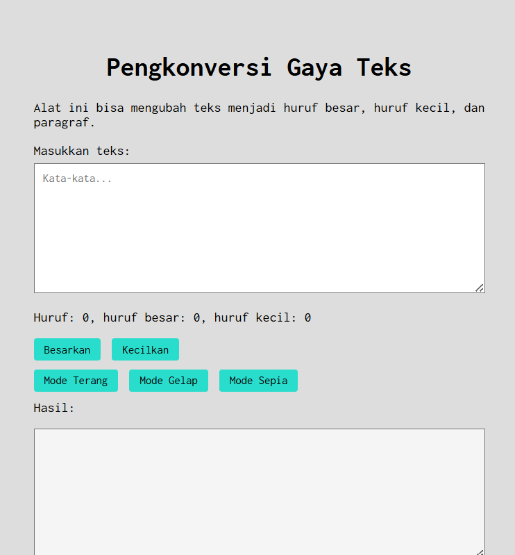
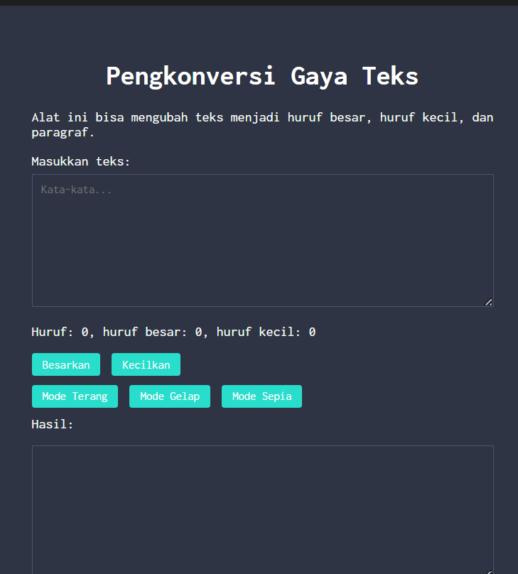
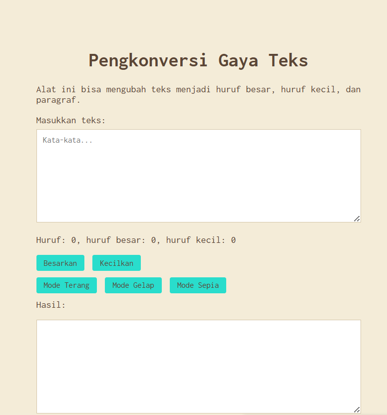

# Tugas Pendahuluan 04  
## Automata dan Table-Driven Construction

**Nama:** Ahmad Shofi
**NIM:** 103122400024
**Kelas:**  SE-08-01

---

# Deskripsi Tugas

Pada tugas ini diminta untuk menambahkan **mode sepia** pada program pengkonversi gaya teks. Mode sepia harus diterapkan pada **editor hasil (`editor-kecil`) serta tombol-tombol yang tersedia**. Selain itu, ketiga tombol mode (terang, gelap, sepia) harus dikelompokkan dalam satu wadah yaitu `mode-div`.

Ketentuan yang diberikan adalah sebagai berikut:

| Mode | Latar Belakang Container | Warna Teks | Form |
|------|-------------------------|------------|------|
| Terang (Light) | `#ddd` | Hitam | Putih |
| Gelap (Dark) | `#2e3443` | Putih | `#2e3443` |
| Sepia | `#F4ECD8` | `#5B4636` | Putih |

Ketentuan tambahan:
- Warna latar belakang **tombol**: `#29ddcc`
- Pinggiran tombol dihilangkan dengan properti **border: none**
- Pergantian antar mode harus berjalan **mulus** (smooth transition)
- Bagian `mode-div` harus menaungi tiga button: `light`, `dark`, dan `sepia`

Fitur ini memungkinkan pengguna untuk beralih antara **mode terang**, **mode gelap**, dan **mode sepia** sehingga tampilan aplikasi lebih nyaman digunakan sesuai preferensi pengguna.

---

# Kode Sumber

Kode program terdiri dari tiga file utama:

| File | Deskripsi |
|------|-----------|
| `index.html` | Struktur halaman web |
| `style.css` | Pengaturan tampilan (layout, warna, font) |
| `script.js` | Logika program menggunakan JavaScript |

---

# Fitur Program

Program memiliki beberapa fitur utama:

1. Menghitung jumlah **huruf total**
2. Menghitung jumlah **huruf besar**
3. Menghitung jumlah **huruf kecil**
4. Mengubah teks menjadi **huruf besar**
5. Mengubah teks menjadi **huruf kecil**
6. **Mode terang** (default)
7. **Mode gelap**
8. **Mode sepia**
9. Tampilan sederhana dengan font **Inconsolata**
10. Pergantian mode yang **mulus** dengan efek transisi

---

# Output Program

## Mode Terang (Default)

Pada mode terang, tampilan program menggunakan latar belakang terang dengan warna standar sehingga mudah dibaca dalam kondisi pencahayaan normal.



## Mode Gelap

Pada mode gelap, tampilan editor hasil berubah menjadi warna `#2e3443` dengan teks berwarna putih sehingga nyaman digunakan di lingkungan dengan pencahayaan minim.



## Mode Sepia

Pada mode sepia, tampilan menggunakan latar belakang `#F4ECD8` dengan teks berwarna `#5B4636` memberikan nuansa klasik dan nyaman untuk mata. Form input tetap berwarna putih agar mudah dibaca.



---

# Cara Menggunakan Program

1. Masukkan teks pada kotak **Masukkan teks**.
2. Sistem akan otomatis menghitung:
- Jumlah huruf
- Jumlah huruf besar
- Jumlah huruf kecil
3. Klik tombol:
- **Besarkan** → mengubah teks hasil menjadi huruf besar
- **Kecilkan** → mengubah teks hasil menjadi huruf kecil
4. Gunakan tombol mode untuk mengubah tampilan aplikasi:
- **Mode Terang** → tampilan terang (default)
- **Mode Gelap** → tampilan gelap
- **Mode Sepia** → tampilan sepia

---

# Deskripsi Program

Program ini berfungsi untuk memproses dan mengubah gaya teks secara **real-time**, baik menjadi **huruf besar**, **huruf kecil**, maupun format paragraf yang rapi. Selain fitur konversi, alat ini juga secara otomatis menghitung **total jumlah huruf serta merinci jumlah huruf besar dan huruf kecil** yang diinputkan pengguna ke dalam kotak teks.

Dengan tampilan antarmuka yang **bersih dan dapat berubah antara tiga tema (terang, gelap, dan sepia)**, serta menggunakan font **Inconsolata** dan tata letak yang diposisikan di tengah halaman, program ini memberikan pengalaman penggunaan yang **fokus dan intuitif**.

**Implementasi Mode:**
- **Mode Terang**: Menggunakan warna latar `#ddd` dengan teks hitam, cocok untuk penggunaan di siang hari.
- **Mode Gelap**: Menggunakan warna latar `#2e3443` dengan teks putih, ideal untuk penggunaan di malam hari.
- **Mode Sepia**: Menggunakan warna latar `#F4ECD8` dengan teks cokelat `#5B4636`, memberikan nuansa klasik yang nyaman untuk mata.

**Pergantian Mode:**
Pergantian antar mode dilakukan dengan menghapus dan menambahkan class CSS pada elemen `body` dan `.container`. Pendekatan ini memungkinkan transisi yang mulus dan kode yang mudah dipelihara. Ketiga tombol mode dikelompokkan dalam `mode-div` sesuai dengan ketentuan tugas.

---

# Teknologi yang Digunakan

- **HTML5** - Struktur halaman web
- **CSS3** - Pengaturan tampilan, layout, dan animasi transisi
- **JavaScript (ES6)** - Logika program, perhitungan huruf, dan pergantian mode
- **Google Fonts (Inconsolata)** - Font monospace untuk tampilan yang rapi

---

# Struktur Kode

## index.html
```html
<!DOCTYPE html>
<html lang="id">
<head>
 <meta charset="UTF-8">
 <title>Pengkonversi Gaya Teks</title>
 <link href="https://fonts.googleapis.com/css2?family=Inconsolata:wght@400;700&display=swap" rel="stylesheet">
 <link rel="stylesheet" href="style.css">
</head>
<body>
 <div class="container" id="container">
     <h1>Pengkonversi Gaya Teks</h1>
     <p>Alat ini bisa mengubah teks menjadi huruf besar, huruf kecil, dan paragraf.</p>
     
     <label for="teks">Masukkan teks:</label>
     <textarea id="teks" placeholder="Kata-kata..." oninput="hitungHuruf()"></textarea>
     
     <p>Huruf: <span id="total">0</span>, huruf besar: <span id="besar">0</span>, huruf kecil: <span id="kecil">0</span></p>
     
     <div class="btn">
         <button onclick="ubahKeHurufBesar()">Besarkan</button>
         <button onclick="ubahKeHurufKecil()">Kecilkan</button>
     </div>
     
     <div class="mode-div">
         <button onclick="modeTerang()">Mode Terang</button>
         <button onclick="modeGelap()">Mode Gelap</button>
         <button onclick="modeSepia()">Mode Sepia</button>
     </div>
     
     <label for="editor-kecil">Hasil:</label>
     <textarea id="editor-kecil" readonly></textarea>
 </div>
 
 <script src="script.js"></script>
</body>
</html>

style.css

/* Mode Sepia */
body.sepia-mode {
    background: #F4ECD8;
}

.container.sepia-mode {
    background: #F4ECD8;
    color: #5B4636;
}

.container.sepia-mode textarea {
    background: white;
    color: #5B4636;
}

.container.sepia-mode #editor-kecil {
    background: white;
    color: #5B4636;
}

--

script.js
function modeSepia() {
    // Hapus semua class mode
    document.body.classList.remove('light-mode', 'dark-mode');
    document.getElementById("container").classList.remove('light-mode', 'dark-mode');
    
    // Tambah class sepia-mode
    document.body.classList.add('sepia-mode');
    document.getElementById("container").classList.add('sepia-mode');
}

--

Kesimpulan
Program ini berhasil mengimplementasikan tiga mode tampilan (terang, gelap, dan sepia) pada aplikasi pengkonversi gaya teks. Dengan menggunakan pendekatan class-based styling dan event handling yang tepat, pergantian antar mode berjalan dengan mulus dan sesuai dengan ketentuan yang diberikan. Penambahan mode sepia memberikan variasi tampilan yang lebih beragam sehingga pengguna dapat memilih mode yang paling nyaman sesuai dengan preferensi dan kondisi pencahayaan lingkungan.