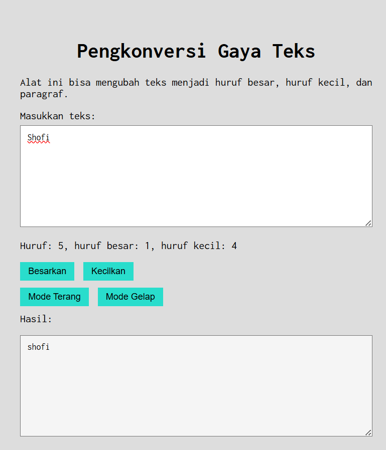
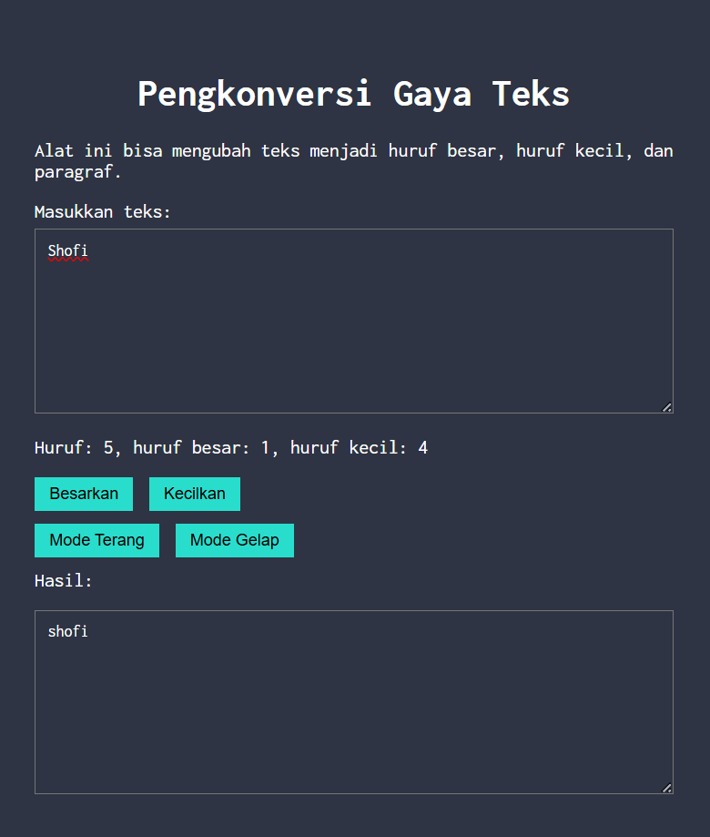

# Tugas Pendahuluan 04  
## Automata dan Table-Driven Construction

**Nama:** Ahmad Shofi
**NIM:** 103122400024
**Kelas:** SE-08-01  

---

# Deskripsi Tugas

Pada tugas ini diminta untuk menambahkan **mode gelap (dark mode)** pada program pengkonversi gaya teks. Mode gelap harus diterapkan pada **editor hasil (`editor-kecil`) serta tombol-tombol yang tersedia**.

Ketentuan yang diberikan adalah sebagai berikut:

- Warna latar belakang **editor-kecil**: `#2e3443`
- Warna latar belakang **tombol**: `#29ddcc`
- Warna teks tombol tetap mengikuti warna teks sebelumnya
- Pinggiran tombol dihilangkan dengan properti **border: none**

Fitur ini memungkinkan pengguna untuk beralih antara **mode terang (default)** dan **mode gelap** sehingga tampilan aplikasi lebih nyaman digunakan.

---

# Kode Sumber

Kode program terdiri dari tiga file utama:

| File | Deskripsi |
|-----|-----------|
| `index.html` | Struktur halaman web |
| `style.css` | Pengaturan tampilan (layout, warna, font) |
| `script.js` | Logika program menggunakan JavaScript |

---

# Fitur Program

Program memiliki beberapa fitur utama:

1. Menghitung jumlah **huruf total**
2. Menghitung jumlah **huruf besar**
3. Menghitung jumlah **huruf kecil**
4. Mengubah teks menjadi **huruf besar**
5. Mengubah teks menjadi **huruf kecil**
6. **Mode terang dan mode gelap**
7. Tampilan sederhana dengan font **Inconsolata**

---

# Output Program

## Mode Terang (Default)

Pada mode terang, tampilan program menggunakan latar belakang terang dengan warna standar sehingga mudah dibaca dalam kondisi pencahayaan normal.

## Mode Gelap

Pada mode gelap, tampilan editor hasil berubah menjadi warna:

# Cara Menjalankan Program

1. Download atau clone repository ini.
2. Buka folder project.
3. Jalankan file:
index.html
4. Program akan langsung terbuka di browser.

# Cara Menggunakan Program

1. Masukkan teks pada kotak **Masukkan teks**.
2. Sistem akan otomatis menghitung:
   - jumlah huruf
   - huruf besar
   - huruf kecil
3. Klik tombol:
   - **Besarkan** → mengubah teks menjadi huruf besar
   - **Kecilkan** → mengubah teks menjadi huruf kecil
4. Gunakan tombol:
   - **Mode Terang**
   - **Mode Gelap**

untuk mengubah tampilan aplikasi.

---

# Deskripsi Program

Program ini berfungsi untuk memproses dan mengubah gaya teks secara **real-time**, baik menjadi **huruf besar**, **huruf kecil**, maupun format paragraf yang rapi. Selain fitur konversi, alat ini juga secara otomatis menghitung **total jumlah karakter serta merinci jumlah huruf besar dan huruf kecil** yang diinputkan pengguna ke dalam kotak teks.

Dengan tampilan antarmuka yang **bersih dan dapat berubah antara tema gelap dan terang**, serta menggunakan font **Inconsolata** dan tata letak yang diposisikan di tengah halaman, program ini memberikan pengalaman penggunaan yang **fokus dan intuitif**.

---

# Teknologi yang Digunakan

- HTML
- CSS
- JavaScript
- Google Fonts (Inconsolata)
