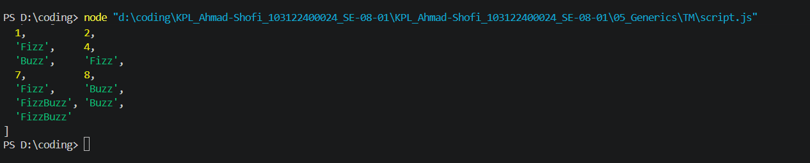

# Tugas Pendahuluan 04
## Fungsi FizzBuzz dengan Pola Generik

**Nama:** Ahmad Shofi  
**NIM:** 103122400024  
**Kelas:** SE-08-01

---

## Deskripsi Tugas

Pada tugas ini diminta untuk membuat **fungsi FizzBuzz** dengan pendekatan modular menggunakan dua fungsi:

- `zzzzOrNum()` - Fungsi yang mengubah satu bilangan menjadi "Fizz", "Buzz", "FizzBuzz", atau tetap bilangan
- `fizzBuzz()` - Fungsi generik yang memproses seluruh larik bilangan menggunakan `zzzzOrNum()`

**Ketentuan yang diberikan adalah sebagai berikut:**

- Fungsi `fizzBuzz` hanya menerima larik yang semua elemennya terdiri dari bilangan bulat
- Fungsi `fizzBuzz` mengeluarkan larik yang bisa jadi bercampur string dan bilangan
- Fungsi `zzzzOrNum` hanya menerima sebuah data tunggal berupa bilangan bulat
- Fungsi `zzzzOrNum` mengembalikan:
  - `"Fizz"` jika bilangan kelipatan 3
  - `"Buzz"` jika bilangan kelipatan 5
  - `"FizzBuzz"` jika bilangan kelipatan 3 dan 5
  - Bilangan asli jika bukan kelipatan 3 maupun 5
- Kedua fungsi harus disertai JSDoc sesuai tipe data yang diharapkan
- `fizzBuzz` harus menggunakan fungsi `zzzzOrNum` di dalamnya

Fitur ini memungkinkan penggunaan **fungsi modular** untuk menangani aturan FizzBuzz sehingga kode lebih **efisien**, **mudah dipelihara**, dan **dapat diuji secara terpisah**.

---

## Kode Sumber

Kode program terdiri dari satu file utama:

| File | Deskripsi |
|------|-----------|
| `script.js` | File JavaScript yang berisi fungsi `zzzzOrNum()`, `fizzBuzz()`, dan kode pengujian |

---

## Fitur Program

Program memiliki beberapa fitur utama:

1. Mengubah bilangan tunggal menjadi **Fizz**, **Buzz**, atau **FizzBuzz** sesuai aturan
2. Memproses **seluruh larik bilangan** sekaligus
3. Mengembalikan larik baru **tanpa mengubah larik asli**
4. Dilengkapi **JSDoc** untuk dokumentasi tipe data
5. Kode yang **modular** dan **mudah diuji**

---

## Output Program



**Contoh Penggunaan:**

```javascript
const testArray = [1, 2, 3, 4, 5, 6, 7, 8, 9, 10, 15, 20, 30];
const result = fizzBuzz(testArray);

console.log("Input:", testArray);
console.log("Output:", result);

---

Deskripsi Program
Program ini berfungsi untuk mengimplementasikan aturan FizzBuzz dengan pendekatan modular menggunakan dua fungsi:

Fungsi zzzzOrNum(value)
Fungsi ini menangani konversi satu bilangan berdasarkan aturan FizzBuzz:

Memeriksa apakah bilangan habis dibagi 3 dan 5 → mengembalikan "FizzBuzz"

Memeriksa apakah bilangan habis dibagi 3 → mengembalikan "Fizz"

Memeriksa apakah bilangan habis dibagi 5 → mengembalikan "Buzz"

Selain itu → mengembalikan bilangan asli

Fungsi fizzBuzz(sequence)
Fungsi ini menerima larik bilangan dan memprosesnya dengan:

Menggunakan method map() untuk mengiterasi setiap elemen

Memanggil fungsi zzzzOrNum() untuk setiap elemen

Mengembalikan larik baru dengan hasil konversi

Dengan pendekatan ini, program menjadi lebih modular karena logika konversi dipisahkan dari logika iterasi, sehingga mudah dikembangkan dan diuji secara terpisah.

--- 
kode pemograman lengkap
---
/**
 * Mengubah bilangan menjadi "Fizz", "Buzz", "FizzBuzz", atau tetap bilangan
 * @param {number} value - Bilangan bulat yang akan diproses
 * @returns {string|number} - "Fizz" jika kelipatan 3, "Buzz" jika kelipatan 5,
 *                            "FizzBuzz" jika kelipatan 3 dan 5, atau bilangan asli jika bukan keduanya
 */
function zzzzOrNum(value) {
    if (value % 3 === 0 && value % 5 === 0) {
        return "FizzBuzz";
    } else if (value % 3 === 0) {
        return "Fizz";
    } else if (value % 5 === 0) {
        return "Buzz";
    } else {
        return value;
    }
}

/**
 * Memproses larik bilangan menjadi larik dengan aturan FizzBuzz
 * @param {number[]} sequence - Larik yang berisi bilangan bulat
 * @returns {Array<string|number>} - Larik hasil konversi FizzBuzz
 */
function fizzBuzz(sequence) {
    const newSequence = sequence.map((e) => zzzzOrNum(e));
    return newSequence;
}

// Test code
const testArray = [1, 2, 3, 4, 5, 6, 7, 8, 9, 10, 15, 20, 30];
const result = fizzBuzz(testArray);

console.log("Input:", testArray);
console.log("Output:", result);

module.exports = {
    fizzBuzz: fizzBuzz,
    zzzzOrNum: zzzzOrNum,
};

Kesimpulan
Program ini berhasil mengimplementasikan aturan FizzBuzz dengan pendekatan modular menggunakan dua fungsi terpisah. Fungsi zzzzOrNum() menangani logika konversi satu bilangan, sedangkan fungsi fizzBuzz() menangani iterasi seluruh larik. Dengan dilengkapi JSDoc, kode menjadi lebih terdokumentasi dengan baik dan mudah dipahami. Pendekatan ini memungkinkan pengujian unit pada masing-masing fungsi secara terpisah serta memudahkan pemeliharaan kode di masa mendatang.