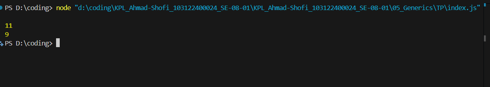

# Tugas Pendahuluan 04  
## Fungsi Generik Penghitung Karakter

**Nama:** Ahmad Shofi
**NIM:** 103122400024
**Kelas:** SE-08-01

---

# Deskripsi Tugas

Pada tugas ini diminta untuk membuat **fungsi generik** yang dapat menangani dua jenis perhitungan karakter dalam sebuah string, yaitu:
- Menghitung **semua karakter** (termasuk spasi)
- Menghitung **hanya huruf** (tanpa spasi)

Ketentuan yang diberikan adalah sebagai berikut:

- Fungsi harus dapat menangani kedua perhitungan dengan **satu fungsi generik**
- Fungsi menerima dua parameter: `str` (string yang akan dihitung) dan `tipe` (jenis perhitungan)
- Jika `tipe` adalah `"semua"`, fungsi mengembalikan jumlah semua karakter termasuk spasi
- Jika `tipe` adalah `"huruf"`, fungsi mengembalikan jumlah karakter yang bukan spasi
- Jika `tipe` tidak dikenal, fungsi tidak mengembalikan nilai apa pun (undefined)

Fitur ini memungkinkan penggunaan **satu fungsi** untuk menangani berbagai kebutuhan perhitungan karakter sehingga kode lebih **efisien** dan **mudah dipelihara**.

---

# Kode Sumber

Kode program terdiri dari satu file utama:

| File | Deskripsi |
|------|-----------|
| `index.js` | File JavaScript yang berisi fungsi generik `hitung()` dan kode pengujian |

---

# Fitur Program

Program memiliki beberapa fitur utama:

1. Menghitung **semua karakter** dalam string (termasuk spasi)
2. Menghitung **hanya huruf** dalam string (tanpa spasi)
3. Menggunakan **satu fungsi generik** untuk kedua jenis perhitungan
4. Kode yang **efisien** dan **mudah dipelihara**

---

# Output Program

Contoh Penggunaan:

const str = "Bar bar bar";

// Menghitung semua karakter
console.log(hitung(str, "semua")); // Output: 11

// Menghitung hanya huruf
console.log(hitung(str, "huruf")); // Output: 9

// Tipe tidak dikenal (tidak menghasilkan output)
hitung(str, "angka"); // Tidak mengembalikan nilai  

Deskripsi Program
Program ini berfungsi untuk menghitung karakter dalam sebuah string dengan satu fungsi generik yang dapat menangani berbagai jenis perhitungan. Fungsi hitung() dirancang dengan struktur kondisional yang memeriksa parameter tipe untuk menentukan jenis perhitungan yang akan dilakukan.

Untuk tipe "semua", fungsi melakukan iterasi pada setiap karakter dalam string dan menjumlahkannya tanpa kecuali.

Untuk tipe "huruf", fungsi melakukan iterasi pada setiap karakter namun melewatkan spasi (karakter ' ') sehingga hanya huruf yang dihitung.

Dengan pendekatan ini, program menjadi lebih modular dan mudah dikembangkan jika nantinya ingin menambahkan jenis perhitungan lain seperti menghitung angka, tanda baca, atau karakter spesifik lainnya.

Kode Program Lengkap

function hitung(str, tipe) {
    if (tipe === "semua") {
        let jumlahSemua = 0;
        for (const c of str) {
            jumlahSemua++;
        }
        return jumlahSemua;
    } 
    else if (tipe === "huruf") {
        let jumlahHuruf = 0;
        for (const c of str) {
            if (c === ' ') continue;
            jumlahHuruf++;
        }
        return jumlahHuruf;
    }
    // Jika tipe tidak dikenal, tidak mengembalikan apa-apa (undefined)
}

// Test code
const str = "Bar bar bar";

console.log(
    hitung(str, "semua") // Harusnya 11
);

console.log(
    hitung(str, "huruf") // Harusnya 9
);

hitung(str, "huruf"); // Tidak terjadi apa-apa (tidak ada console.log)

Kesimpulan
Program ini berhasil mengimplementasikan fungsi generik yang dapat menangani dua jenis perhitungan karakter dalam sebuah string. Dengan menggunakan pendekatan kondisional, fungsi ini dapat menentukan jenis perhitungan berdasarkan parameter yang diberikan, sehingga mengurangi duplikasi kode dan meningkatkan efisiensi pengembangan.