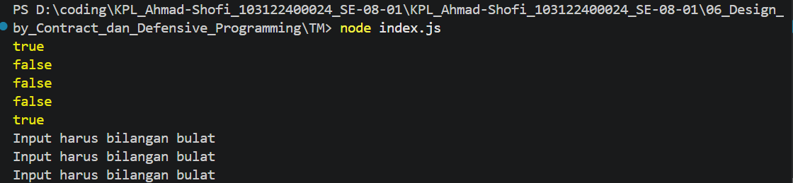

# Tugas Mandiri  
## Fungsi is_not_fizzbuzz (JavaScript)

**Nama:** Ahmad Shofi  
**NIM:** 103122400024  
**Kelas:** SE-08-01  

---

## Deskripsi Tugas

Pada tugas ini diminta untuk membuat sebuah fungsi bernama `is_not_fizzbuzz(number)` yang bertujuan untuk menyaring bilangan berdasarkan aturan FizzBuzz, yaitu menolak bilangan yang merupakan kelipatan 3, 5, atau 15, serta hanya menerima bilangan bulat yang valid.

Fungsi ini juga harus mampu melakukan validasi terhadap input, dan melempar error jika nilai yang diberikan bukan merupakan bilangan bulat yang valid, seperti `null`, `NaN`, atau `Infinity`.

---

## Ketentuan

Fungsi `is_not_fizzbuzz` harus memenuhi aturan berikut:

- Menerima satu parameter berupa bilangan bulat
- Mengembalikan `false` jika bilangan merupakan kelipatan 3 atau 5
- Mengembalikan `true` jika bukan kelipatan 3 maupun 5
- Melempar `TypeError` jika input:
  - Bukan number
  - Bukan bilangan bulat
  - Bernilai `NaN`, `Infinity`, atau `null`

---

## Kode Program

```javascript
function is_not_fizzbuzz(number) {
    if (!Number.isInteger(number)) {
        throw new TypeError("Input harus bilangan bulat");
    }

    if (number % 3 === 0 || number % 5 === 0) {
        return false;
    }

    return true;
}
```

---

## Fitur Program

Program memiliki beberapa fitur utama:

1. Memvalidasi input agar hanya menerima bilangan bulat  
2. Menolak bilangan kelipatan 3, 5, atau 15  
3. Mengembalikan nilai boolean (`true` atau `false`)  
4. Melempar error jika input tidak valid  
5. Mudah diuji dengan berbagai skenario  

---

## Contoh Penggunaan

```javascript
console.log(is_not_fizzbuzz(1))   // true
console.log(is_not_fizzbuzz(3))   // false
console.log(is_not_fizzbuzz(5))   // false
console.log(is_not_fizzbuzz(30))  // false
console.log(is_not_fizzbuzz(7))   // true
```

---

## Contoh Error Handling

```javascript
try {
    console.log(is_not_fizzbuzz(null));
} catch (error) {
    console.log(error.message);
}

try {
    console.log(is_not_fizzbuzz(NaN));
} catch (error) {
    console.log(error.message);
}

try {
    console.log(is_not_fizzbuzz(Infinity));
} catch (error) {
    console.log(error.message);
}
```

Output:


```
Input harus bilangan bulat
```

---

## Deskripsi Program

Fungsi `is_not_fizzbuzz` bekerja dengan cara memvalidasi terlebih dahulu apakah input yang diberikan merupakan bilangan bulat menggunakan `Number.isInteger()`, sehingga dapat memastikan bahwa nilai seperti `NaN`, `Infinity`, atau tipe data lain akan ditolak, kemudian fungsi melakukan pengecekan apakah bilangan tersebut merupakan kelipatan 3 atau 5 menggunakan operator modulus (`%`), dan jika iya maka fungsi akan mengembalikan `false`, sedangkan jika bukan maka fungsi akan mengembalikan `true`.

Pendekatan ini memastikan bahwa fungsi hanya menerima input yang valid serta menghasilkan output yang sesuai dengan aturan FizzBuzz.

---

## Kesimpulan

Program ini berhasil mengimplementasikan fungsi penyaring bilangan berdasarkan aturan FizzBuzz dengan validasi input yang ketat, sehingga mampu mencegah kesalahan akibat input yang tidak valid serta memberikan hasil yang konsisten.

Keunggulan program:

- Validasi input yang ketat  
- Error handling yang jelas  
- Logika sederhana dan mudah dipahami  
- Mudah diuji dan dikembangkan  

Pendekatan ini membantu meningkatkan kualitas kode dan memastikan program tetap robust terhadap berbagai kondisi input.