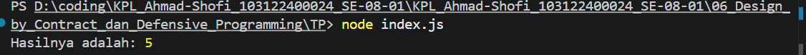

# Tugas Pendahuluan 06  
## Design by Contract & Defensive Programming (JavaScript)

**Nama:** Ahmad Shofi  
**NIM:** 103122400024  
**Kelas:** SE-08-01  

---

## Deskripsi Tugas

Pada tugas ini diminta untuk mengimplementasikan dan membandingkan dua pendekatan dalam menangani kesalahan pada program, yaitu Design by Contract (menggunakan assertion) dan Defensive Programming (menggunakan exception) melalui studi kasus fungsi `divide(a, b)`.

Fungsi ini digunakan untuk melakukan operasi pembagian dua bilangan dengan beberapa aturan validasi, yaitu parameter harus berupa number dan tidak boleh melakukan pembagian dengan nol. Kedua pendekatan digunakan untuk memahami perbedaan cara menangani error, apakah sebagai pelanggaran kontrak internal atau sebagai kesalahan input yang harus ditangani secara eksplisit.

---

## Kode Sumber

Kode program terdiri dari satu file utama:

| File | Deskripsi |
|------|-----------|
| index.js | Berisi implementasi fungsi divide dengan assertion dan exception |

---

## Implementasi Program

### 1. Menggunakan Assertion (Design by Contract)

Pendekatan ini menggunakan modul `assert` untuk memastikan kondisi tertentu terpenuhi sebelum program dijalankan, sehingga assertion berfungsi sebagai penjaga asumsi internal program.

```javascript
const assert = require('assert');

function divide(a, b) {
    assert(typeof a === 'number' && typeof b === 'number', 'Nilai harus bilangan bulat');
    assert(b !== 0, 'Tidak bisa pembagian dengan nol');
    return a / b;
}
```

---

### 2. Menggunakan Exception (Defensive Programming)

Pendekatan ini menggunakan `throw` untuk melempar error jika terjadi kondisi yang tidak valid, sehingga error dapat ditangani menggunakan `try...catch`.

```javascript
function divide(a, b) {
    if (typeof a !== "number" || typeof b !== "number") {
        throw new TypeError("Nilai harus bilangan bulat");
    }

    if (b === 0) {
        throw new Error("Tidak bisa pembagian dengan nol");
    }

    return a / b;
}
```

---

## Fitur Program

Program memiliki beberapa fitur utama sebagai berikut:

1. Melakukan operasi pembagian dua bilangan  
2. Memvalidasi tipe data input  
3. Mencegah pembagian dengan nol  
4. Menyediakan dua pendekatan penanganan error  
5. Menghasilkan pesan error yang jelas  
6. Mudah diuji dengan berbagai input  

---

## Output Program


---

## Output Program

Contoh penggunaan:

```javascript
try {
    const result = divide(10, 2);
    console.log("Hasilnya adalah:", result);
} catch (error) {
    console.error("Error:", error.message);
}
```

Output:
```
Hasilnya adalah: 5
```

Jika terjadi error:
```
Error: Tidak bisa pembagian dengan nol
```

---

## Deskripsi Program

Program ini mengimplementasikan fungsi divide dengan dua pendekatan berbeda dalam menangani kesalahan. Pada pendekatan assertion, program memastikan bahwa kondisi internal seperti tipe data dan nilai pembagi sesuai dengan yang diharapkan, sehingga jika terjadi pelanggaran maka akan menghasilkan AssertionError. Pendekatan ini biasanya digunakan pada tahap debugging untuk memastikan logika program tetap konsisten.

Pada pendekatan exception, program secara eksplisit memvalidasi input yang diberikan dan melempar error jika terjadi kondisi yang tidak valid, sehingga error dapat ditangani menggunakan mekanisme try-catch. Pendekatan ini lebih fleksibel dan cocok digunakan dalam aplikasi nyata karena mampu mengontrol alur program saat terjadi kesalahan.

---

## Kesimpulan

Program ini berhasil mengimplementasikan dua pendekatan dalam menangani error, yaitu assertion dan exception. Assertion digunakan untuk memastikan kondisi internal program, sedangkan exception digunakan untuk menangani kesalahan input secara fleksibel.

Pendekatan exception lebih direkomendasikan untuk digunakan dalam pengembangan aplikasi karena lebih aman dan memberikan kontrol yang lebih baik terhadap penanganan error, sedangkan assertion lebih cocok digunakan sebagai alat bantu debugging selama proses pengembangan.

Dengan adanya kedua pendekatan ini, kualitas program menjadi lebih baik, lebih mudah dipelihara, dan lebih robust terhadap berbagai kondisi yang mungkin terjadi saat dijalankan.