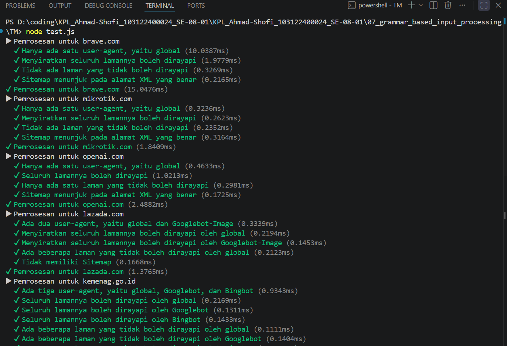

# Tugas Mandiri 07  
## Parser robots.txt menjadi POJO (JavaScript)

**Nama:** Ahmad Shofi  
**NIM:** 103122400024  
**Kelas:** SE-08-01  

---

## Deskripsi Tugas

Pada tugas ini diminta untuk membuat sebuah fungsi bernama `parseRobots` yang bertugas untuk menguraikan isi berkas `robots.txt` menjadi sebuah POJO (*plain old JavaScript object*). Fungsi ini harus mampu membaca isi teks `robots.txt` lalu memetakan setiap bagian penting ke dalam object JavaScript agar lebih mudah diproses oleh program.

Empat properti utama yang harus diperhatikan dalam berkas `robots.txt` adalah `User-agent`, `Allow`, `Disallow`, dan `Sitemap`. `User-agent` menunjukkan nama robot perayap yang dimaksud, `Allow` berisi daftar halaman yang boleh dirayapi, `Disallow` berisi daftar halaman yang tidak boleh dirayapi, sedangkan `Sitemap` menunjukkan alamat peta situs web yang umumnya berformat XML.

Fungsi ini dikerjakan di dalam berkas `index.js` dan akan diuji menggunakan `test.js` terhadap beberapa berkas `robots.txt` yang telah disediakan pada folder `daftar`. Oleh karena itu, fungsi yang dibuat harus menghasilkan struktur object yang sesuai dengan kebutuhan pengujian.

---

## Kode Sumber

Kode program terdiri dari beberapa file berikut:

| File | Deskripsi |
|------|-----------|
| `index.js` | Berisi implementasi fungsi `parseRobots` |
| `test.js` | Berisi pengujian otomatis terhadap fungsi `parseRobots` |
| `structure.d.ts` | Berisi definisi struktur data (opsional) |
| `daftar/*.txt` | Kumpulan file `robots.txt` dari beberapa situs untuk diuji |

---

## Kode Program

```javascript
/**
 * @param {string} text
 * @returns {import('./structure').RobotsTxt} 
 */
function parseRobots(text) {
    const result = {
        agents: {},
        Sitemap: []
    };

    let currentAgents = [];

    const lines = text.split(/\r?\n/);

    for (let rawLine of lines) {
        let line = rawLine.trim();

        if (!line || line.startsWith("#")) continue;

        const commentIndex = line.indexOf("#");
        if (commentIndex !== -1) {
            line = line.slice(0, commentIndex).trim();
        }

        if (!line) continue;

        const [keyRaw, ...rest] = line.split(":");
        if (!rest.length) continue;

        const key = keyRaw.trim().toLowerCase();
        const value = rest.join(":").trim();

        if (!value) continue;

        if (key === "user-agent") {
            const agent = value.toLowerCase();

            if (!result.agents[agent]) {
                result.agents[agent] = {
                    Allow: [],
                    Disallow: []
                };
            }

            currentAgents = [agent];
        } else if (key === "allow") {
            for (const agent of currentAgents) {
                result.agents[agent].Allow.push(value);
            }
        } else if (key === "disallow") {
            for (const agent of currentAgents) {
                result.agents[agent].Disallow.push(value);
            }
        } else if (key === "sitemap") {
            result.Sitemap.push(value);
        }
    }

    return result;
}

module.exports = parseRobots;
```

---

## Fitur Program

Program ini memiliki beberapa fitur utama, yaitu mampu membaca isi teks `robots.txt`, mengenali pasangan `key:value` pada setiap baris, mengelompokkan aturan berdasarkan `User-agent`, menyimpan daftar halaman yang boleh dirayapi pada properti `Allow`, menyimpan daftar halaman yang tidak boleh dirayapi pada properti `Disallow`, serta menyimpan semua alamat `Sitemap` ke dalam array global. Program ini juga dapat mengabaikan baris kosong dan komentar, serta menangani penulisan huruf besar dan kecil dengan cara yang konsisten.

---

## Struktur Output

Fungsi `parseRobots` menghasilkan object dengan struktur seperti berikut:

```javascript
{
  agents: {
    "*": {
      Allow: [],
      Disallow: []
    },
    "googlebot": {
      Allow: ["/"],
      Disallow: ["/private/"]
    }
  },
  Sitemap: ["https://example.com/sitemap.xml"]
}
```

Struktur ini digunakan agar setiap `User-agent` memiliki aturan masing-masing, sementara `Sitemap` disimpan secara global di luar agent.

---

## Contoh Penggunaan

```javascript
const parseRobots = require("./index");

const sample = `
User-agent: *
Disallow: /admin
Allow: /public
Sitemap: https://example.com/sitemap.xml

User-agent: Googlebot
Allow: /
Disallow: /private/
`;

console.log(parseRobots(sample));
```
ouput program

---

## Contoh Output

```javascript
{
  agents: {
    "*": {
      Allow: ["/public"],
      Disallow: ["/admin"]
    },
    "googlebot": {
      Allow: ["/"],
      Disallow: ["/private/"]
    }
  },
  Sitemap: ["https://example.com/sitemap.xml"]
}
```

---

## Deskripsi Program

Program ini bekerja dengan cara memecah isi teks `robots.txt` menjadi baris-baris menggunakan pemisah baris, kemudian setiap baris diproses satu per satu. Jika ditemukan baris kosong atau komentar, maka baris tersebut akan diabaikan. Jika ditemukan komentar di akhir baris, komentar tersebut akan dihapus terlebih dahulu sebelum baris diproses lebih lanjut.

Setelah itu, program memisahkan setiap baris menjadi bagian `key` dan `value` berdasarkan tanda titik dua (`:`). Nilai `key` diubah menjadi huruf kecil agar proses pencocokan lebih konsisten. Ketika program menemukan `User-agent`, maka agent tersebut akan dijadikan agent aktif dan dibuatkan object baru jika belum ada. Jika program menemukan `Allow` atau `Disallow`, maka nilai tersebut akan dimasukkan ke dalam agent yang sedang aktif. Jika program menemukan `Sitemap`, maka nilainya akan dimasukkan ke dalam array `Sitemap` global.

Dengan pendekatan ini, isi `robots.txt` dapat diubah menjadi struktur data JavaScript yang rapi, mudah dibaca, dan mudah diuji.

---

## Kesimpulan

Program ini berhasil mengimplementasikan fungsi `parseRobots` untuk mengubah isi `robots.txt` menjadi POJO sesuai kebutuhan pengujian. Fungsi ini mampu membaca aturan per `User-agent`, menyimpan daftar `Allow` dan `Disallow`, serta mengumpulkan seluruh `Sitemap` secara global. Selain itu, program juga mampu menangani komentar, baris kosong, dan perbedaan huruf besar-kecil.

Keunggulan program ini adalah struktur output yang jelas, logika parsing yang sederhana, mudah diuji menggunakan `test.js`, serta mudah dikembangkan untuk kebutuhan yang lebih kompleks di masa mendatang. Dengan demikian, fungsi `parseRobots` dapat digunakan sebagai dasar untuk memahami cara kerja parser sederhana dalam JavaScript.