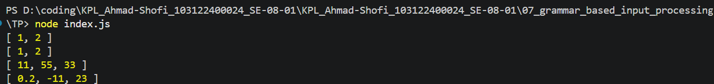

# Tugas Pendahuluan 
## Fungsi toNumberArray (JavaScript)

**Nama:** Ahmad Shofi  
**NIM:** 103122400024  
**Kelas:** SE-08-01  

---

## Deskripsi Tugas

Pada tugas ini diminta untuk membuat sebuah fungsi bernama `toNumberArray(input)` yang berfungsi untuk mengubah deretan angka yang bertipe string menjadi sebuah larik (array) berisi angka (number). Fungsi ini harus mampu menangani berbagai bentuk input, baik berupa string tunggal maupun array of string, serta mengekstrak angka yang terdapat di dalamnya, termasuk bilangan desimal dan bilangan negatif.

Selain itu, fungsi juga harus mampu mengabaikan karakter non-angka dan hanya mengambil nilai numerik yang valid dari input yang diberikan.

---

## Ketentuan

Fungsi `toNumberArray` harus memenuhi aturan berikut:

- Menerima input berupa:
  - String (misalnya: `"1, 2"`)
  - Array of string (misalnya: `["1", "2"]`)
- Mengembalikan array berisi number
- Mendukung:
  - Bilangan bulat
  - Bilangan desimal
  - Bilangan negatif
- Mengabaikan karakter non-angka (misalnya `"abc23"` → `23`)
- Mengembalikan array kosong jika tidak ditemukan angka

---

## Kode Program

```javascript
function toNumberArray(input) {
    const str = Array.isArray(input) ? input.join(" ") : input;

    const matches = str.match(/-?\d+(\.\d+)?/g);

    if (!matches) return [];

    return matches.map(Number);
}
```

---

## Fitur Program

Program memiliki beberapa fitur utama sebagai berikut:

1. Mendukung input berupa string maupun array  
2. Mengubah string angka menjadi tipe number  
3. Mendukung bilangan desimal dan negatif  
4. Mengabaikan karakter non-angka  
5. Mengembalikan array kosong jika tidak ada angka  
6. Mudah digunakan dan diuji  

---

## Contoh Penggunaan

```javascript
console.log(toNumberArray("1, 2"))                 
// Output: [1, 2]

console.log(toNumberArray(["1", "2"]))             
// Output: [1, 2]

console.log(toNumberArray(" 11,55,33 "))           
// Output: [11, 55, 33]

console.log(toNumberArray(["0.2", "-11", "abc23"])) 
// Output: [0.2, -11, 23]
```

---

## Output Program



```
[1, 2]
[1, 2]
[11, 55, 33]
[0.2, -11, 23]
```

---

## Deskripsi Program

Fungsi `toNumberArray` bekerja dengan cara menggabungkan input menjadi satu string jika input berupa array, kemudian menggunakan regular expression untuk mengekstrak semua angka yang terdapat di dalam string tersebut, termasuk angka desimal dan angka negatif. Hasil ekstraksi berupa array string kemudian dikonversi menjadi array number menggunakan fungsi `map(Number)`.

Pendekatan ini memungkinkan fungsi untuk menangani berbagai format input dengan fleksibel serta tetap menghasilkan output yang konsisten berupa array angka.

---

## Kesimpulan

Program ini berhasil mengimplementasikan fungsi untuk mengubah deretan string menjadi array angka dengan dukungan berbagai format input dan validasi sederhana.

Keunggulan program:

- Fleksibel terhadap berbagai bentuk input  
- Mendukung angka desimal dan negatif  
- Mengabaikan karakter tidak relevan  
- Implementasi sederhana dan efisien  
- Mudah diuji dan dikembangkan  

Dengan pendekatan ini, program menjadi lebih robust dan dapat digunakan dalam berbagai kebutuhan pemrosesan data berbasis string.