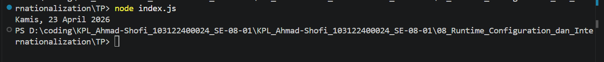

# Tugas Pendahuluan
## Menampilkan Tanggal Saat Ini (JavaScript - Intl.DateTimeFormat)

**Nama:** Ahmad Shofi  
**NIM:** 103122400024  
**Kelas:** SE-08-01  

---

## Deskripsi Tugas

Pada tugas ini diminta untuk menampilkan tanggal saat ini dengan format tertentu menggunakan JavaScript. Format yang diharapkan adalah dalam bentuk bahasa Indonesia, yaitu:

```
Sabtu, 18 April 2026
```

Tanggal yang ditampilkan tidak harus sama dengan contoh, namun format penulisan harus sesuai. Untuk menyelesaikan tugas ini, digunakan objek `Intl.DateTimeFormat` agar format tanggal dapat menyesuaikan dengan locale yang digunakan tanpa perlu menyusun string secara manual.

---

## Ketentuan

Program harus memenuhi beberapa ketentuan berikut:

- Menggunakan `Intl.DateTimeFormat`
- Menggunakan locale Bahasa Indonesia (`id-ID`)
- Menampilkan:
  - Nama hari (weekday)
  - Tanggal (day)
  - Nama bulan (month)
  - Tahun (year)
- Format akhir: `Hari, Tanggal Bulan Tahun`

---

## Kode Program

```javascript
const now = new Date();

const parts = new Intl.DateTimeFormat("id-ID", {
    weekday: "long",
    day: "numeric",
    month: "long",
    year: "numeric"
}).formatToParts(now);

const result = `${parts[0].value}, ${parts[2].value} ${parts[4].value} ${parts[6].value}`;

console.log(result);
```

---

## Fitur Program

Program memiliki beberapa fitur utama sebagai berikut:

1. Mengambil tanggal saat ini secara otomatis  
2. Menggunakan locale Bahasa Indonesia  
3. Menghasilkan format tanggal yang rapi dan sesuai aturan  
4. Tidak menggunakan manipulasi string manual  
5. Menggunakan API bawaan JavaScript (`Intl.DateTimeFormat`)  

---

## Output

---

## Contoh Output

```
Sabtu, 18 April 2026
```

Catatan: Nilai tanggal akan menyesuaikan dengan waktu saat program dijalankan.

---

## Deskripsi Program

Program ini bekerja dengan membuat objek `Date` untuk mendapatkan waktu saat ini, kemudian menggunakan `Intl.DateTimeFormat` dengan locale `"id-ID"` untuk memformat tanggal ke dalam Bahasa Indonesia. Fungsi `formatToParts()` digunakan agar setiap bagian tanggal seperti hari, tanggal, bulan, dan tahun dapat diambil secara terpisah, sehingga memungkinkan penyusunan ulang format sesuai kebutuhan dengan menambahkan tanda koma setelah nama hari.

Pendekatan ini lebih baik dibandingkan menyusun string secara manual karena lebih fleksibel, mengikuti standar internasional, dan menghindari kesalahan format.

---

## Kesimpulan

Program ini berhasil menampilkan tanggal saat ini dalam format Bahasa Indonesia menggunakan `Intl.DateTimeFormat`. Pendekatan ini memberikan hasil yang konsisten, rapi, dan sesuai standar tanpa perlu manipulasi string secara manual.

Keunggulan program:

- Menggunakan API standar JavaScript  
- Format sesuai locale Indonesia  
- Mudah dipahami dan digunakan  
- Fleksibel untuk berbagai format tanggal  

Dengan pendekatan ini, program menjadi lebih robust dan sesuai praktik terbaik dalam pengolahan tanggal di JavaScript.