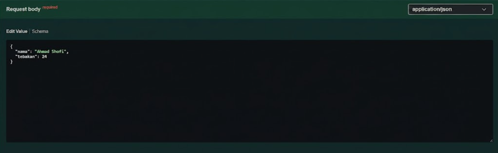
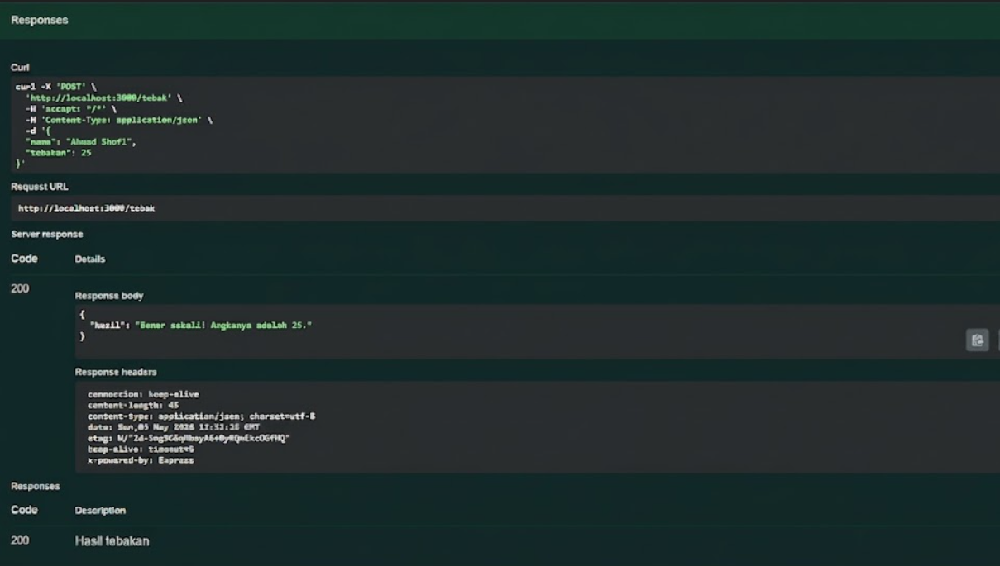
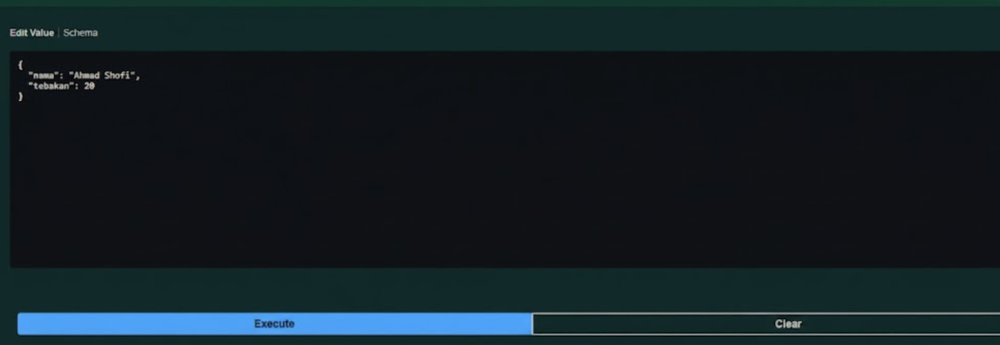
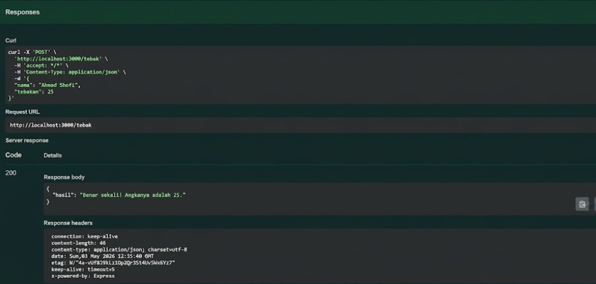

# Tugas Mandiri 09
## API Tebak Angka Acak Tetap Berdasarkan Nama

**Nama:** Ahmad Shofi  
**NIM:** 103122400024  
**Kelas:** SE-08-01  

---

## Deskripsi Tugas

Pada tugas mandiri ini diminta untuk membuat sebuah API sederhana menggunakan **Node.js** dan **Express.js**. API ini digunakan untuk permainan tebak angka, di mana pengguna mengirimkan nama dan angka tebakan melalui request `POST`.

API hanya memiliki satu endpoint utama, yaitu:

```http
POST /
```

Request dikirim dalam format JSON dengan data berupa nama pemain dan angka tebakan. Sistem kemudian akan menentukan sebuah angka acak tetap berdasarkan nama pemain tersebut. Jika tebakan sesuai dengan angka yang ditentukan, maka API akan mengembalikan jawaban bahwa tebakan benar. Jika tebakan terlalu tinggi atau terlalu rendah, API akan memberikan pesan sesuai kondisi tersebut.

---

## Ketentuan Tugas

Program harus memenuhi beberapa ketentuan berikut:

1. API terdiri dari satu endpoint saja, yaitu `POST /`
2. Angka yang dihasilkan harus tetap untuk nama yang sama
3. Angka boleh berbeda untuk nama yang berbeda
4. Rentang angka harus berada di antara 1 sampai 100
5. Nama bersifat sensitif terhadap huruf besar dan huruf kecil
6. Tidak menggunakan pustaka apa pun untuk menentukan angka berdasarkan nama dan tebakan
7. Response dikembalikan dalam format JSON

---

## Format Request

Contoh request yang dikirim ke API:

```json
{
  "nama": "Hamid",
  "tebakan": 24
}
```

Keterangan:

- `nama` berisi nama pemain
- `tebakan` berisi angka yang ditebak oleh pemain
- Angka tebakan berada dalam rentang 1 sampai 100

---

## Format Response

Jika tebakan benar, maka API akan mengembalikan response seperti berikut:

```json
{
  "jawaban": "Benar sekali! Tebakannya adalah 24."
}
```

Jika tebakan terlalu tinggi, maka API akan mengembalikan response seperti berikut:

```json
{
  "jawaban": "Tebakanmu terlalu tinggi!"
}
```

Jika tebakan terlalu rendah, maka API akan mengembalikan response seperti berikut:

```json
{
  "jawaban": "Tebakanmu terlalu rendah!"
}
```

---

## Konsep Penyelesaian

Untuk membuat angka tetap berdasarkan nama, program menggunakan nilai **ASCII** dari setiap karakter pada nama. Setiap karakter pada nama memiliki nilai ASCII yang berbeda.

Nilai ASCII dari seluruh karakter pada nama dijumlahkan, kemudian hasilnya diolah menggunakan operator modulo agar angka tetap berada dalam rentang 1 sampai 100.

Rumus yang digunakan:

```javascript
const angka = (totalAscii % 100) + 1;
```

Dengan rumus tersebut, nama yang sama akan selalu menghasilkan angka yang sama. Namun, nama yang berbeda dapat menghasilkan angka yang berbeda.

Selain itu, karena huruf besar dan huruf kecil memiliki nilai ASCII yang berbeda, maka nama `hamid` dan `Hamid` akan menghasilkan angka yang berbeda.

---

## Struktur File

Struktur file yang digunakan pada program ini adalah sebagai berikut:

```text
TM_09/
├── index.js
├── swagger.js
```

Keterangan:

- `index.js` berisi kode utama server Express dan endpoint API
- `swagger.js` berisi konfigurasi Swagger

---

## Kode Program

### 1. File `index.js`

```javascript
const express = require("express");
const { swaggerUi, specs } = require("./swagger");

const app = express();
const PORT = 3000;

app.use(express.json());
app.use("/docs", swaggerUi.serve, swaggerUi.setup(specs));

/**
 * @swagger
 * /:
 *   post:
 *     summary: Endpoint untuk permainan tebak angka
 *     description: Menerima nama dan angka tebakan, lalu mengembalikan hasil tebakan.
 *     requestBody:
 *       required: true
 *       content:
 *         application/json:
 *           schema:
 *             type: object
 *             required:
 *               - nama
 *               - tebakan
 *             properties:
 *               nama:
 *                 type: string
 *                 example: Hamid
 *                 description: Nama pemain
 *               tebakan:
 *                 type: integer
 *                 example: 24
 *                 description: Angka tebakan pemain
 *     responses:
 *       200:
 *         description: Berhasil mendapatkan hasil tebakan
 *         content:
 *           application/json:
 *             schema:
 *               type: object
 *               properties:
 *                 jawaban:
 *                   type: string
 *                   example: Benar sekali! Tebakannya adalah 24.
 *       400:
 *         description: Request tidak valid
 */
app.post("/", (req, res) => {
  const { nama, tebakan } = req.body;

  if (typeof nama !== "string" || nama.length === 0) {
    return res.status(400).json({
      jawaban: "Nama harus diisi dalam bentuk string!",
    });
  }

  if (typeof tebakan !== "number" || tebakan < 1 || tebakan > 100) {
    return res.status(400).json({
      jawaban: "Tebakan harus berupa angka antara 1 sampai 100!",
    });
  }

  let totalAscii = 0;

  for (let i = 0; i < nama.length; i++) {
    totalAscii += nama.charCodeAt(i);
  }

  const angka = (totalAscii % 100) + 1;

  let jawaban;

  if (tebakan < angka) {
    jawaban = "Tebakanmu terlalu rendah!";
  } else if (tebakan > angka) {
    jawaban = "Tebakanmu terlalu tinggi!";
  } else {
    jawaban = `Benar sekali! Tebakannya adalah ${angka}.`;
  }

  res.json({
    jawaban,
  });
});

app.listen(PORT, () => {
  console.log(`Server berjalan di http://localhost:${PORT}`);
});
```

---

### 2. File `swagger.js`

```javascript
const swaggerJsdoc = require("swagger-jsdoc");
const swaggerUi = require("swagger-ui-express");

const options = {
  definition: {
    openapi: "3.0.0",
    info: {
      title: "API Tebak Angka",
      version: "1.0.0",
      description:
        "API sederhana untuk permainan tebak angka berdasarkan nama pemain.",
    },
  },
  apis: ["index.js"],
};

const specs = swaggerJsdoc(options);

module.exports = {
  specs,
  swaggerUi,
};
```

---


## Cara Menjalankan Program

Langkah-langkah menjalankan program adalah sebagai berikut:

1. Buka terminal pada folder project.
2. Jalankan perintah berikut untuk menginstall dependency:

```bash
npm install
```

3. Jalankan server dengan perintah:

```bash
npm start
```

4. Jika server berhasil berjalan, maka akan muncul pesan:

```bash
Server berjalan di http://localhost:3000
```

5. Dokumentasi Swagger dapat dibuka melalui browser pada alamat:

```http
http://localhost:3000/docs
```

---

## Cara Kerja Program

Program berjalan dengan menerima request `POST /` yang berisi nama dan tebakan. Setelah request diterima, program akan membaca nilai `nama` dan `tebakan` dari body request.

Selanjutnya, program akan menghitung total nilai ASCII dari setiap karakter pada nama. Setiap huruf pada nama memiliki nilai ASCII tertentu, kemudian seluruh nilai tersebut dijumlahkan.

Hasil penjumlahan nilai ASCII tersebut digunakan untuk menghasilkan angka tetap menggunakan operasi modulo 100, lalu ditambahkan 1 agar hasil berada pada rentang 1 sampai 100.

Setelah angka target terbentuk, program membandingkan angka tersebut dengan nilai tebakan dari pengguna. Jika tebakan lebih kecil dari angka target, maka program menampilkan pesan bahwa tebakan terlalu rendah. Jika tebakan lebih besar dari angka target, maka program menampilkan pesan bahwa tebakan terlalu tinggi. Jika nilainya sama, maka program menampilkan pesan bahwa tebakan benar.

---

## Contoh Pengujian API

### 1. Tebakan Benar

Request:

```json
{
  "nama": "Hamid",
  "tebakan": 24
}
```

Response:

```json
{
  "jawaban": "Benar sekali! Tebakannya adalah 24."
}
```

---

### 2. Tebakan Terlalu Tinggi

Request:

```json
{
  "nama": "Hamid",
  "tebakan": 90
}
```

Response:

```json
{
  "jawaban": "Tebakanmu terlalu tinggi!"
}
```

---

### 3. Tebakan Terlalu Rendah

Request:

```json
{
  "nama": "Hamid",
  "tebakan": 10
}
```

Response:

```json
{
  "jawaban": "Tebakanmu terlalu rendah!"
}
```

---

## Fitur Program

Program memiliki beberapa fitur utama sebagai berikut:

1. Menerima input nama dan tebakan melalui request JSON
2. Menghasilkan angka tetap berdasarkan nama pemain
3. Mendukung perbedaan huruf besar dan huruf kecil pada nama
4. Memberikan response sesuai hasil tebakan
5. Memiliki validasi untuk input yang tidak sesuai
6. Menggunakan Express.js sebagai framework API
7. Menggunakan Swagger untuk dokumentasi API

---

## Output









---

## Kesimpulan

Program API Tebak Angka berhasil dibuat menggunakan Node.js dan Express.js. API ini dapat menerima nama dan angka tebakan, kemudian menghasilkan angka tetap berdasarkan nama tersebut.

Dengan menggunakan perhitungan nilai ASCII, nama yang sama akan selalu menghasilkan angka yang sama, sedangkan nama yang berbeda dapat menghasilkan angka yang berbeda. Program ini juga mendukung perbedaan huruf besar dan huruf kecil karena setiap karakter memiliki nilai ASCII yang berbeda.

Program ini sudah memenuhi ketentuan tugas, yaitu menggunakan satu endpoint `POST /`, menghasilkan angka dalam rentang 1 sampai 100, bersifat sensitif terhadap huruf besar dan huruf kecil, serta tidak menggunakan pustaka tambahan untuk menentukan angka berdasarkan nama.

Keunggulan program:

- Sederhana dan mudah dipahami
- Hasil angka tetap untuk nama yang sama
- Response jelas sesuai kondisi tebakan
- Sudah dilengkapi dokumentasi Swagger
- Memiliki validasi input dasar

Dengan adanya program ini, konsep pembuatan API sederhana menggunakan Express.js dapat dipahami dengan lebih baik, terutama dalam penggunaan request body, response JSON, validasi input, dan dokumentasi API menggunakan Swagger.