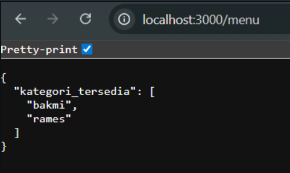
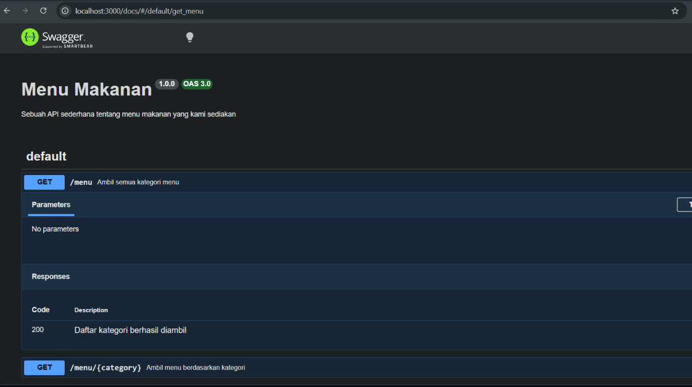

# Tugas Pendahuluan 09
## Endpoint GET `/menu` dengan Dokumentasi OpenAPI

**Nama:** Ahmad Shofi  
**NIM:** 103122400024  
**Kelas:** SE-08-01  

---

## Deskripsi Tugas

Pada tugas pendahuluan ini diminta untuk membuat satu endpoint tambahan beserta dokumentasi OpenAPI-nya. Endpoint yang dibuat adalah:

```http
GET /menu
```

Endpoint tersebut digunakan untuk menampilkan daftar semua nama kategori menu yang tersedia. Data menu disimpan dalam bentuk object JavaScript, kemudian kategori menu diambil menggunakan method `Object.keys()`.

API ini dibuat menggunakan **Node.js**, **Express.js**, dan dokumentasi API dibuat menggunakan **Swagger OpenAPI**.

---

## Ketentuan Tugas

Program harus memenuhi beberapa ketentuan berikut:

1. Membuat endpoint `GET /menu`
2. Endpoint menampilkan semua nama kategori menu yang tersedia
3. Response dikembalikan dalam format JSON
4. Membuat dokumentasi OpenAPI untuk endpoint `GET /menu`
5. Dokumentasi dapat diakses melalui Swagger UI
6. API berjalan pada port `3000`

---

## Data Menu

Data menu yang digunakan pada program adalah sebagai berikut:

```javascript
const menuData = {
    bakmi: {
        "bakmi ayam spesial": 25000,
        "bakmi rica-rica": 28000,
        "bakmi komplit (bakso pangsit)": 35000
    },
    rames: {
        "nasi rames biasa": 15000,
        "nasi rames rendang": 25000,
        "nasi rames telur balado": 18000
    }
};
```

Pada data tersebut terdapat dua kategori menu, yaitu:

- `bakmi`
- `rames`

---

## Format Endpoint

Endpoint yang dibuat:

```http
GET /menu
```

Endpoint ini tidak membutuhkan parameter maupun request body.

---

## Format Response

Jika endpoint berhasil diakses, maka API akan mengembalikan response seperti berikut:

```json
{
  "kategori_tersedia": [
    "bakmi",
    "rames"
  ]
}
```

Keterangan:

- `kategori_tersedia` berisi daftar kategori menu yang tersedia
- Data kategori diambil dari key pada object `menuData`

---

## Struktur File

Struktur file yang digunakan pada program ini adalah sebagai berikut:

```text
TP_09/
├── index.js
├── swagger.js
```

Keterangan:

- `index.js` berisi kode utama server Express dan endpoint API
- `swagger.js` berisi konfigurasi Swagger OpenAPI
---

## Kode Program

### 1. File `index.js`

```javascript
const express = require('express');
const { specs, swaggerUi } = require('./swagger.js');

const app = express();
const port = 3000;

const menuData = {
    bakmi: {
        "bakmi ayam spesial": 25000,
        "bakmi rica-rica": 28000,
        "bakmi komplit (bakso pangsit)": 35000
    },
    rames: {
        "nasi rames biasa": 15000,
        "nasi rames rendang": 25000,
        "nasi rames telur balado": 18000
    }
};

app.use('/docs', swaggerUi.serve, swaggerUi.setup(specs));

/** 
 * @swagger
 * /menu:
 *     get:
 *       summary: Ambil semua kategori menu
 *       responses:
 *         200:
 *           description: Daftar kategori berhasil diambil
 */
app.get('/menu', (req, res) => {
    const categories = Object.keys(menuData);

    res.json({
        kategori_tersedia: categories
    });
});

/**
 * @swagger
 * /menu/{category}:
 *     get:
 *       summary: Ambil menu berdasarkan kategori
 *       parameters:
 *         - in: path
 *           name: category
 *           required: true
 *           description: Nama kategori menu
 *           schema:
 *             type: string
 *       responses:
 *         200:
 *           description: Menu berhasil diambil
 *         404:
 *           description: Kategori tidak ditemukan
 */
app.get('/menu/:category', (req, res) => {
    const category = req.params.category;
    const menu = menuData[category];

    if (menu) {
        res.json(menu);
    } else {
        res.status(404).json({
            error: "Menu tidak ditemukan"
        });
    }
});

app.listen(port, () => {
    console.log(`Server jalan di http://localhost:${port}`);
    console.log(`Cek Swagger di http://localhost:${port}/docs`);
});
```

---

### 2. File `swagger.js`

```javascript
const swaggerJsdoc = require('swagger-jsdoc');
const swaggerUi = require('swagger-ui-express');

const options = {
  definition: {
    openapi: '3.0.0',
    info: {
      title: 'Menu Makanan',
      version: '1.0.0',
      description: 'Sebuah API sederhana tentang menu makanan yang kami sediakan',
    },
  },
  apis: ['./index.js'],
};

const specs = swaggerJsdoc(options);

module.exports = {
  specs,
  swaggerUi,
};
```

---

## Cara Menjalankan Program

Langkah-langkah menjalankan program adalah sebagai berikut:

1. Buka terminal pada folder project.
2. Jalankan perintah berikut untuk menginstall dependency:

```bash
npm install
```

3. Jalankan server dengan perintah:

```bash
npm start
```

4. Jika server berhasil berjalan, maka akan muncul pesan:

```bash
Server jalan di http://localhost:3000
Cek Swagger di http://localhost:3000/docs
```

5. Dokumentasi Swagger dapat dibuka melalui browser pada alamat:

```http
http://localhost:3000/docs
```

6. Endpoint daftar kategori menu dapat diakses melalui:

```http
http://localhost:3000/menu
```

---

## Cara Kerja Program

Program berjalan dengan membuat server menggunakan Express.js. Data menu disimpan dalam object bernama `menuData`. Object tersebut memiliki beberapa kategori menu, yaitu `bakmi` dan `rames`.

Saat pengguna mengakses endpoint `GET /menu`, program akan mengambil semua nama kategori yang ada di dalam object `menuData`. Pengambilan nama kategori dilakukan menggunakan method `Object.keys()`.

Kode yang digunakan untuk mengambil kategori adalah sebagai berikut:

```javascript
const categories = Object.keys(menuData);
```

Hasil dari method tersebut berupa array yang berisi nama-nama kategori menu. Setelah itu, data dikirimkan sebagai response JSON dengan key `kategori_tersedia`.

---

## Dokumentasi OpenAPI

Dokumentasi OpenAPI dibuat menggunakan komentar Swagger pada file `index.js`. Dokumentasi tersebut menjelaskan endpoint `GET /menu`, fungsi endpoint, dan response yang dikembalikan.

Kode dokumentasi OpenAPI untuk endpoint `GET /menu` adalah sebagai berikut:

```javascript
/** 
 * @swagger
 * /menu:
 *     get:
 *       summary: Ambil semua kategori menu
 *       responses:
 *         200:
 *           description: Daftar kategori berhasil diambil
 */
```

Dengan dokumentasi tersebut, endpoint `GET /menu` akan tampil pada Swagger UI. Pengguna dapat melihat informasi endpoint dan mencobanya langsung melalui halaman dokumentasi.

---

## Contoh Pengujian API

### Request

```http
GET http://localhost:3000/menu
```

### Response

```json
{
  "kategori_tersedia": [
    "bakmi",
    "rames"
  ]
}
```

---

## Fitur Program

Program memiliki beberapa fitur utama sebagai berikut:

1. Menampilkan daftar kategori menu yang tersedia
2. Mengembalikan response dalam format JSON
3. Menggunakan Express.js sebagai framework API
4. Menggunakan Swagger UI sebagai dokumentasi API
5. Memiliki endpoint untuk melihat menu berdasarkan kategori
6. Mudah dijalankan pada server lokal

---

## Output

### Tampilan Dokumentasi Swagger




### Hasil GET `/menu`



---

## Kesimpulan

Program berhasil membuat endpoint `GET /menu` untuk menampilkan daftar semua kategori menu yang tersedia. Data kategori diambil dari object `menuData` menggunakan method `Object.keys()`, kemudian dikirimkan dalam bentuk response JSON.

Endpoint ini juga sudah dilengkapi dengan dokumentasi OpenAPI menggunakan Swagger. Dengan adanya Swagger UI, pengguna dapat melihat daftar endpoint yang tersedia dan melakukan pengujian API secara langsung melalui browser.

Keunggulan program:

- Endpoint sederhana dan mudah dipahami
- Response menggunakan format JSON
- Data kategori diambil secara otomatis dari object menu
- Dokumentasi API tersedia melalui Swagger UI
- Program berjalan menggunakan Express.js

Dengan adanya tugas ini, pemahaman mengenai pembuatan endpoint API dan dokumentasi OpenAPI menggunakan Swagger menjadi lebih baik.