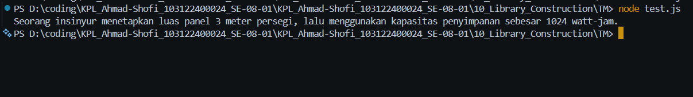

# Tugas Mandiri 10
## Pustaka JavaScript `mtk-gampang`

**Nama:** Ahmad Shofi  
**NIM:** 103122400024  
**Kelas:** SE-08-01  

---

## Deskripsi Tugas

Pada tugas mandiri ini diminta untuk membuat sebuah pustaka JavaScript yang rapi dengan nama project `mtk-gampang`. Pustaka ini berisi beberapa fungsi matematika sederhana yang dapat digunakan kembali pada project JavaScript lain.

Pustaka yang dibuat memiliki tiga fungsi utama, yaitu fungsi untuk menghitung pangkat, membulatkan bilangan ke bawah, dan menghitung akar kuadrat dari suatu bilangan.

Setiap fungsi disimpan pada file terpisah di dalam folder `lib`. Setiap file pada folder `lib` hanya memiliki satu fungsi saja. Semua fungsi kemudian dihubungkan melalui file `index.js` sebagai file utama pustaka.

---

## Ketentuan Tugas

Program harus memenuhi beberapa ketentuan berikut:

1. Membuat project baru bernama `mtk-gampang`
2. Struktur project harus tersusun rapi
3. Setiap file di dalam folder `lib` hanya memiliki satu fungsi
4. File `pangkat.js` berisi fungsi `pangkat(x, y)`
5. File `bulat.js` berisi fungsi `bulat(x)`
6. File `kuadrat.js` berisi fungsi `kuadrat(x)`
7. Fungsi harus diakses melalui `index.js`
8. File `index.js` digunakan sebagai nilai dari properti `main` pada `package.json`
9. Pustaka dapat digunakan kembali pada project JavaScript lain

---

## Fungsi yang Dibuat

Pustaka `mtk-gampang` memiliki tiga fungsi utama sebagai berikut:

### 1. Fungsi `pangkat(x, y)`

Fungsi ini digunakan untuk menghitung nilai akhir dari `x` pangkat `y`.

Contoh:

```javascript
pangkat(2, 10);
```

Hasil:

```text
1024
```

---

### 2. Fungsi `bulat(x)`

Fungsi ini digunakan untuk mengubah bilangan non-bulat menjadi bilangan bulat ke bawah.

Contoh:

```javascript
bulat(4.25);
```

Hasil:

```text
4
```

---

### 3. Fungsi `kuadrat(x)`

Fungsi ini digunakan untuk menghitung nilai akar kuadrat dari `x`.

Contoh:

```javascript
kuadrat(12);
```

Hasil:

```text
3.4641016151377544
```

---

## Struktur File

Struktur file pada project `mtk-gampang` adalah sebagai berikut:

```text
mtk-gampang/
├── index.js
├── package.json
├── tes.js
└── lib/
    ├── pangkat.js
    ├── bulat.js
    └── kuadrat.js
```

Keterangan:

- `index.js` berfungsi sebagai file utama pustaka
- `package.json` berisi informasi dan konfigurasi pustaka
- `tes.js` digunakan untuk menguji fungsi pustaka
- Folder `lib` berisi file-file fungsi matematika
- `pangkat.js` berisi fungsi untuk menghitung pangkat
- `bulat.js` berisi fungsi untuk membulatkan bilangan ke bawah
- `kuadrat.js` berisi fungsi untuk menghitung akar kuadrat

---

## Kode Program

### 1. File `package.json`

```json
{
  "name": "mtk-gampang",
  "version": "1.0.0",
  "description": "Pustaka JavaScript sederhana untuk operasi matematika",
  "main": "index.js",
  "type": "module",
  "author": "Ahmad Shofi",
  "license": "ISC"
}
```

---

### 2. File `index.js`

```javascript
import pangkat from "./lib/pangkat.js";
import bulat from "./lib/bulat.js";
import kuadrat from "./lib/kuadrat.js";

export { pangkat, bulat, kuadrat };
```

File `index.js` digunakan sebagai file utama pustaka. File ini mengambil fungsi dari folder `lib`, kemudian mengekspor kembali fungsi tersebut agar dapat digunakan dari satu pintu utama.

---

### 3. File `lib/pangkat.js`

```javascript
function pangkat(x, y) {
  return Math.pow(x, y);
}

export default pangkat;
```

File ini hanya berisi satu fungsi, yaitu `pangkat(x, y)`. Fungsi ini digunakan untuk menghitung nilai `x` pangkat `y`.

---

### 4. File `lib/bulat.js`

```javascript
function bulat(x) {
  return Math.floor(x);
}

export default bulat;
```

File ini hanya berisi satu fungsi, yaitu `bulat(x)`. Fungsi ini digunakan untuk membulatkan bilangan non-bulat ke bawah.

---

### 5. File `lib/kuadrat.js`

```javascript
function kuadrat(x) {
  return Math.sqrt(x);
}

export default kuadrat;
```

File ini hanya berisi satu fungsi, yaitu `kuadrat(x)`. Fungsi ini digunakan untuk menghitung akar kuadrat dari suatu bilangan.

---

### 6. File `tes.js`

```javascript
import { kuadrat, pangkat, bulat } from "./index.js";

const narasi = `Seorang insinyur menetapkan luas panel ${bulat(kuadrat(12))} meter persegi, lalu menggunakan kapasitas penyimpanan sebesar ${pangkat(2, 10)} watt-jam.`;

/**
 * Seorang insinyur menetapkan luas panel 3 meter persegi, lalu menggunakan kapasitas penyimpanan sebesar 1024 watt-jam.
 */

console.log(narasi);
```

File `tes.js` digunakan untuk memastikan bahwa fungsi `kuadrat`, `pangkat`, dan `bulat` berhasil diakses melalui file `index.js`.

---

## Cara Membuat Project

Langkah-langkah membuat project pustaka adalah sebagai berikut:

1. Buat folder project baru:

```bash
mkdir mtk-gampang
```

2. Masuk ke folder project:

```bash
cd mtk-gampang
```

3. Buat file `package.json`:

```bash
npm init -y
```

4. Buat folder `lib`:

```bash
mkdir lib
```

5. Buat file-file yang dibutuhkan:

```bash
type nul > index.js
type nul > tes.js
type nul > lib/pangkat.js
type nul > lib/bulat.js
type nul > lib/kuadrat.js
```

6. Isi setiap file sesuai dengan kode program yang sudah dibuat.

---

## Cara Menjalankan Program

Karena `index.js` digunakan sebagai file utama pustaka untuk melakukan export fungsi, maka file tersebut tidak langsung menampilkan output ketika dijalankan.

Untuk menguji pustaka, jalankan file `tes.js` dengan perintah berikut:

```bash
node tes.js
```

Jika program berhasil dijalankan, maka akan muncul output berikut:

```text
Seorang insinyur menetapkan luas panel 3 meter persegi, lalu menggunakan kapasitas penyimpanan sebesar 1024 watt-jam.
```

---

## Cara Kerja Program

Program pustaka `mtk-gampang` dibuat dengan memisahkan setiap fungsi ke dalam file yang berbeda. Tujuan dari pemisahan ini adalah agar struktur program menjadi lebih rapi dan mudah dipahami.

File `pangkat.js` hanya berisi fungsi `pangkat(x, y)` yang menggunakan `Math.pow()` untuk menghitung nilai pangkat.

File `bulat.js` hanya berisi fungsi `bulat(x)` yang menggunakan `Math.floor()` untuk membulatkan bilangan desimal ke bawah.

File `kuadrat.js` hanya berisi fungsi `kuadrat(x)` yang menggunakan `Math.sqrt()` untuk menghitung akar kuadrat dari suatu angka.

Ketiga fungsi tersebut kemudian diimpor ke dalam file `index.js`, lalu diekspor kembali menggunakan `export`. Dengan cara ini, pengguna pustaka cukup mengakses fungsi melalui file utama `index.js`, bukan langsung dari folder `lib`.

---

## Penjelasan Kode

### 1. Kode Fungsi Pangkat

```javascript
function pangkat(x, y) {
  return Math.pow(x, y);
}
```

Fungsi ini menerima dua parameter, yaitu `x` dan `y`. Parameter `x` adalah angka dasar, sedangkan parameter `y` adalah nilai pangkat. Fungsi ini mengembalikan hasil dari `x` pangkat `y`.

---

### 2. Kode Fungsi Bulat

```javascript
function bulat(x) {
  return Math.floor(x);
}
```

Fungsi ini menerima satu parameter, yaitu `x`. Fungsi ini mengembalikan nilai bilangan bulat ke bawah dari angka yang diberikan.

Contohnya, angka `4.25` akan diubah menjadi `4`.

---

### 3. Kode Fungsi Kuadrat

```javascript
function kuadrat(x) {
  return Math.sqrt(x);
}
```

Fungsi ini menerima satu parameter, yaitu `x`. Fungsi ini mengembalikan nilai akar kuadrat dari angka yang diberikan.

Contohnya, `kuadrat(12)` menghasilkan nilai `3.4641016151377544`.

---

### 4. Kode Ekspor pada `index.js`

```javascript
import pangkat from "./lib/pangkat.js";
import bulat from "./lib/bulat.js";
import kuadrat from "./lib/kuadrat.js";

export { pangkat, bulat, kuadrat };
```

Kode tersebut digunakan untuk mengimpor semua fungsi dari folder `lib`, kemudian mengekspor kembali fungsi tersebut. Dengan cara ini, file `index.js` menjadi pintu utama untuk mengakses seluruh fungsi pustaka.

---

## Contoh Pengujian

Kode pengujian dilakukan melalui file `tes.js`.

```javascript
import { kuadrat, pangkat, bulat } from "./index.js";

const narasi = `Seorang insinyur menetapkan luas panel ${bulat(kuadrat(12))} meter persegi, lalu menggunakan kapasitas penyimpanan sebesar ${pangkat(2, 10)} watt-jam.`;

console.log(narasi);
```

Kode tersebut menggunakan tiga fungsi dari pustaka, yaitu:

- `kuadrat(12)` untuk menghitung akar kuadrat dari 12
- `bulat(kuadrat(12))` untuk membulatkan hasil akar kuadrat ke bawah
- `pangkat(2, 10)` untuk menghitung 2 pangkat 10

Hasil akhirnya dimasukkan ke dalam sebuah kalimat menggunakan template literal.

---

## Output Program

Output yang dihasilkan dari file `tes.js` adalah sebagai berikut:

```text
Seorang insinyur menetapkan luas panel 3 meter persegi, lalu menggunakan kapasitas penyimpanan sebesar 1024 watt-jam.
```

---

## Fitur Program

Program memiliki beberapa fitur utama sebagai berikut:

1. Menghitung nilai pangkat dari dua bilangan
2. Membulatkan bilangan non-bulat ke bawah
3. Menghitung akar kuadrat dari suatu bilangan
4. Setiap fungsi disimpan pada file terpisah
5. Setiap file pada folder `lib` hanya memiliki satu fungsi
6. Fungsi dapat diakses melalui file utama `index.js`
7. Menggunakan module JavaScript modern
8. Struktur project rapi dan mudah dipahami

---

## Kelebihan Struktur Pustaka

Struktur pustaka yang digunakan memiliki beberapa kelebihan, yaitu:

1. Kode lebih rapi
2. Setiap file memiliki satu tanggung jawab
3. Fungsi lebih mudah dikelola
4. File utama `index.js` memudahkan proses ekspor fungsi
5. Pengguna pustaka cukup mengakses fungsi melalui satu file utama
6. Project lebih mudah dikembangkan

---

## Output



---

## Kesimpulan

Pustaka JavaScript `mtk-gampang` berhasil dibuat dengan struktur yang rapi. Pustaka ini memiliki tiga fungsi utama, yaitu `pangkat(x, y)`, `bulat(x)`, dan `kuadrat(x)`.

Fungsi `pangkat(x, y)` digunakan untuk menghitung nilai pangkat. Fungsi `bulat(x)` digunakan untuk membulatkan bilangan non-bulat ke bawah. Fungsi `kuadrat(x)` digunakan untuk menghitung akar kuadrat dari suatu bilangan.

Setiap fungsi diletakkan pada file terpisah di dalam folder `lib`, sehingga struktur pustaka menjadi lebih teratur. Fungsi-fungsi tersebut kemudian diekspor melalui file `index.js`, sehingga pengguna pustaka dapat mengakses semua fungsi dari file utama.

Program ini sudah memenuhi ketentuan tugas karena setiap file di dalam folder `lib` hanya memiliki satu fungsi, fungsi dapat diakses melalui `index.js`, dan `index.js` digunakan sebagai nilai dari properti `main` pada `package.json`.

Keunggulan program:

- Struktur project rapi
- Setiap file hanya memiliki satu fungsi
- Kode mudah dibaca dan dipahami
- Menggunakan sistem module JavaScript modern
- Fungsi dapat digunakan kembali
- Sesuai dengan ketentuan pustaka JavaScript

Dengan adanya pustaka `mtk-gampang`, penggunaan fungsi matematika sederhana dapat dilakukan dengan lebih mudah, terstruktur, dan efisien.