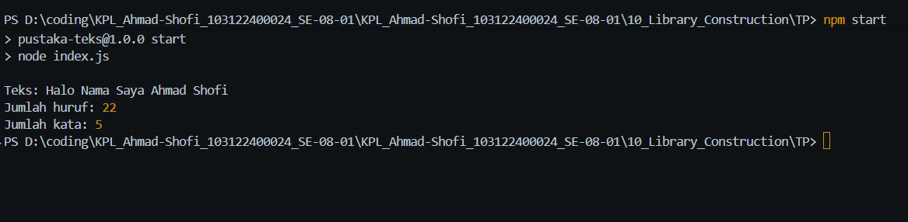

# Tugas Pendahuluan 10
## Pustaka JavaScript Penghitung Jumlah Huruf dan Kata

**Nama:** Ahmad Shofi  
**NIM:** 103122400024  
**Kelas:** SE-08-01  

---

## Deskripsi Tugas

Pada tugas pendahuluan ini diminta untuk membuat sebuah pustaka JavaScript yang menyediakan utilitas berupa dua fungsi. Fungsi pertama digunakan untuk menghitung jumlah huruf, sedangkan fungsi kedua digunakan untuk menghitung jumlah kata.

Pustaka ini hanya menghitung karakter alfabet dari `A` sampai `Z`, baik huruf besar maupun huruf kecil. Karakter selain huruf, seperti angka, simbol, tanda baca, dan spasi tidak dihitung sebagai huruf.

Pustaka dibuat agar dapat digunakan kembali pada file JavaScript lain dengan cara diimpor menggunakan `import`.

---

## Ketentuan Tugas

Program harus memenuhi beberapa ketentuan berikut:

1. Membuat pustaka JavaScript
2. Menyediakan fungsi untuk menghitung jumlah huruf
3. Menyediakan fungsi untuk menghitung jumlah kata
4. Hanya alfabet `A-Z` dan `a-z` yang dihitung
5. Spasi tidak dihitung sebagai huruf
6. Angka, simbol, dan tanda baca tidak dihitung sebagai huruf
7. Pustaka dapat diimpor ke file JavaScript lain

---

## Fungsi yang Dibuat

Pustaka ini memiliki dua fungsi utama, yaitu:

1. `hitungHuruf(teks)`  
   Fungsi ini digunakan untuk menghitung jumlah huruf alfabet dalam sebuah teks.

2. `hitungKata(teks)`  
   Fungsi ini digunakan untuk menghitung jumlah kata yang terdiri dari huruf alfabet.

---

## Struktur File

Struktur file yang digunakan pada program ini adalah sebagai berikut:

```text
TP_10/
├── textUtils.js
├── index.js
└── package.json
```

Keterangan:

- `textUtils.js` berisi pustaka atau fungsi utilitas yang dapat diimpor
- `index.js` digunakan untuk mencoba atau menjalankan fungsi dari pustaka
- `package.json` berisi konfigurasi project JavaScript

---

## Kode Program

### 1. File `textUtils.js`

```javascript
// Fungsi untuk menghitung jumlah huruf A-Z dan a-z
export function hitungHuruf(teks) {
  const huruf = teks.match(/[A-Za-z]/g);

  if (huruf === null) {
    return 0;
  }

  return huruf.length;
}

// Fungsi untuk menghitung jumlah kata yang terdiri dari huruf A-Z dan a-z
export function hitungKata(teks) {
  const kata = teks.match(/[A-Za-z]+/g);

  if (kata === null) {
    return 0;
  }

  return kata.length;
}
```

---

### 2. File `index.js`

```javascript
import { hitungHuruf, hitungKata } from "./textUtils.js";

const kalimat = "Halo Nama Saya Ahmad Shofi";

console.log("Teks:", kalimat);
console.log("Jumlah huruf:", hitungHuruf(kalimat));
console.log("Jumlah kata:", hitungKata(kalimat));
```

---

### 3. File `package.json`

```json
{
  "name": "tp-10-pustaka-teks",
  "version": "1.0.0",
  "description": "Pustaka JavaScript untuk menghitung jumlah huruf dan jumlah kata",
  "main": "index.js",
  "type": "module",
  "scripts": {
    "start": "node index.js"
  }
}
```

---

## Cara Menjalankan Program

Langkah-langkah menjalankan program adalah sebagai berikut:

1. Buka terminal pada folder project.
2. Jalankan program dengan perintah:

```bash
npm start
```

3. Program akan menampilkan hasil jumlah huruf dan jumlah kata dari teks yang sudah ditentukan.

---

## Cara Mengimpor Pustaka

Pustaka yang dibuat pada file `textUtils.js` dapat digunakan pada file JavaScript lain dengan cara diimpor.

Contoh penggunaan:

```javascript
import { hitungHuruf, hitungKata } from "./textUtils.js";

console.log(hitungHuruf("Halo Dunia"));
console.log(hitungKata("Halo Dunia"));
```

Dengan cara tersebut, fungsi `hitungHuruf()` dan `hitungKata()` dapat digunakan kembali tanpa perlu menulis ulang kode program.

---

## Cara Kerja Program

Program bekerja dengan menggunakan regular expression atau regex untuk mengambil karakter yang sesuai dengan ketentuan.

Pada fungsi `hitungHuruf()`, regex yang digunakan adalah:

```javascript
/[A-Za-z]/g
```

Regex tersebut digunakan untuk mencari semua karakter huruf dari `A-Z` dan `a-z`. Setiap huruf yang ditemukan akan dihitung jumlahnya. Spasi, angka, simbol, dan tanda baca tidak akan dihitung.

Pada fungsi `hitungKata()`, regex yang digunakan adalah:

```javascript
/[A-Za-z]+/g
```

Regex tersebut digunakan untuk mencari kumpulan huruf yang membentuk kata. Dengan menggunakan tanda `+`, program akan mengelompokkan satu atau lebih huruf berurutan sebagai satu kata.

---

## Contoh Pengujian Program

### Contoh 1

Input:

```javascript
const kalimat = "Halo Nama Saya Ahmad Shofi";
```

Output:

```text
Teks: Halo Nama Saya Ahmad Shofi
Jumlah huruf: 23
Jumlah kata: 5
```

---

### Contoh 2

Input:

```javascript
console.log(hitungHuruf("Halo Dunia 123!"));
console.log(hitungKata("Halo Dunia 123!"));
```

Output:

```text
9
2
```

Penjelasan:

- Huruf yang dihitung hanya `HaloDunia`
- Spasi tidak dihitung
- Angka `123` tidak dihitung
- Tanda seru `!` tidak dihitung
- Jumlah kata yang dihitung adalah `Halo` dan `Dunia`

---

## Fitur Program

Program memiliki beberapa fitur utama sebagai berikut:

1. Menghitung jumlah huruf dalam sebuah teks
2. Menghitung jumlah kata dalam sebuah teks
3. Hanya menghitung huruf alfabet `A-Z` dan `a-z`
4. Mengabaikan spasi, angka, simbol, dan tanda baca
5. Dapat digunakan kembali dengan cara diimpor
6. Menggunakan module JavaScript modern
7. Kode sederhana dan mudah dipahami

---

## Output



---

## Kesimpulan

Program pustaka JavaScript penghitung huruf dan kata berhasil dibuat. Pustaka ini menyediakan dua fungsi utama, yaitu `hitungHuruf()` dan `hitungKata()`.

Fungsi `hitungHuruf()` digunakan untuk menghitung jumlah huruf alfabet dalam sebuah teks, sedangkan fungsi `hitungKata()` digunakan untuk menghitung jumlah kata yang terdiri dari huruf alfabet. Program ini hanya menghitung huruf dari `A-Z` dan `a-z`, sehingga angka, simbol, tanda baca, dan spasi tidak ikut dihitung.

Program ini juga sudah memenuhi ketentuan tugas karena pustaka dapat diimpor ke file JavaScript lain menggunakan `import`.

Keunggulan program:

- Mudah digunakan
- Kode sederhana dan jelas
- Dapat digunakan kembali sebagai pustaka
- Menggunakan fitur module JavaScript
- Menghitung huruf dan kata sesuai ketentuan

Dengan adanya pustaka ini, proses penghitungan jumlah huruf dan kata pada teks dapat dilakukan dengan lebih mudah dan terstruktur.