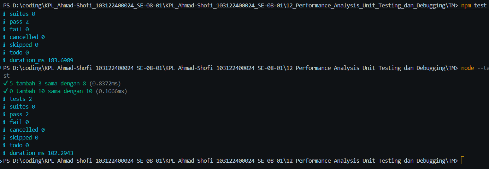

# Tugas Mandiri 12
## Pengujian Fungsi Counter Menggunakan Node Test

**Nama:** Ahmad Shofi  
**NIM:** 103122400024  
**Kelas:** SE-08-01  

---

## Deskripsi Tugas

Pada tugas mandiri ini diminta untuk memeriksa apakah kode program sudah benar atau masih terdapat bagian yang perlu diperbaiki. Program yang diberikan berisi fungsi sederhana bernama `tambahPengitung`.

Fungsi tersebut digunakan untuk melakukan penjumlahan pada sebuah penghitung atau counter. Fungsi menerima dua parameter, yaitu nilai terkini dan jumlah yang akan ditambahkan. Setelah itu, fungsi mengembalikan hasil penjumlahan dari kedua nilai tersebut.

Selain kode fungsi, terdapat juga file pengujian menggunakan `node:test` dan `node:assert`. Pengujian dilakukan untuk memastikan bahwa fungsi `tambahPengitung` menghasilkan nilai yang sesuai.

---

## Kode Awal

### File `hitung.js`

```javascript
function tambahPengitung(terkini, jumlah) {
  terkini = terkini + jumlah;
  return terkini;
}
```

---

### File `hitung.test.js`

```javascript
import { test } from 'node:test';
import assert from 'node:assert';
import { tambahPengitung } from './hitung.js';

test('5 tambah 3 sama dengan 8', () => {
  assert.strictEqual(tambahPengitung(5, 3), 8);
});

test('0 tambah 10 sama dengan 10', () => {
  assert.strictEqual(tambahPengitung(0, 10), 10);
});
```

---

## Analisis Kode

Secara logika, fungsi `tambahPengitung` sudah benar. Fungsi tersebut menerima dua parameter, yaitu `terkini` dan `jumlah`.

Kode berikut:

```javascript
terkini = terkini + jumlah;
```

digunakan untuk menambahkan nilai `jumlah` ke dalam nilai `terkini`.

Setelah hasil penjumlahan diperoleh, nilai tersebut dikembalikan menggunakan:

```javascript
return terkini;
```

Namun, terdapat satu masalah pada file `hitung.js`. Fungsi `tambahPengitung` belum diekspor, sedangkan pada file `hitung.test.js`, fungsi tersebut diimpor menggunakan kode berikut:

```javascript
import { tambahPengitung } from './hitung.js';
```

Agar fungsi dapat digunakan pada file lain, fungsi tersebut harus diekspor menggunakan `export`.

---

## Bagian yang Perlu Diperbaiki

Bagian yang perlu diperbaiki terdapat pada file `hitung.js`.

Kode awal:

```javascript
function tambahPengitung(terkini, jumlah) {
  terkini = terkini + jumlah;
  return terkini;
}
```

Kode tersebut belum memiliki `export`, sehingga fungsi tidak dapat diimpor oleh file `hitung.test.js`.

Perbaikannya adalah menambahkan `export` di depan deklarasi fungsi.

---

## Kode Program Setelah Diperbaiki

### File `hitung.js`

```javascript
export function tambahPengitung(terkini, jumlah) {
  terkini = terkini + jumlah;
  return terkini;
}
```

---

### File `hitung.test.js`

```javascript
import { test } from 'node:test';
import assert from 'node:assert';
import { tambahPengitung } from './hitung.js';

test('5 tambah 3 sama dengan 8', () => {
  assert.strictEqual(tambahPengitung(5, 3), 8);
});

test('0 tambah 10 sama dengan 10', () => {
  assert.strictEqual(tambahPengitung(0, 10), 10);
});
```

---

### File `package.json`

```json
{
  "name": "testing-counter",
  "version": "1.0.0",
  "description": "Pengujian fungsi counter sederhana menggunakan node test",
  "type": "module",
  "scripts": {
    "test": "node --test"
  },
  "author": "Ahmad Shofi",
  "license": "ISC"
}
```

---

## Struktur File

Struktur file pada program ini adalah sebagai berikut:

```text
TM_12/
├── hitung.js
├── hitung.test.js
└── package.json
```

Keterangan:

- `hitung.js` berisi fungsi `tambahPengitung`
- `hitung.test.js` berisi kode pengujian fungsi
- `package.json` berisi konfigurasi project dan script test

---

## Penjelasan Kode

### 1. Fungsi `tambahPengitung`

```javascript
export function tambahPengitung(terkini, jumlah) {
  terkini = terkini + jumlah;
  return terkini;
}
```

Fungsi ini menerima dua parameter, yaitu:

- `terkini`, yaitu nilai counter saat ini
- `jumlah`, yaitu nilai yang akan ditambahkan ke counter

Fungsi ini akan menjumlahkan nilai `terkini` dengan `jumlah`, kemudian mengembalikan hasilnya.

Contoh:

```javascript
tambahPengitung(5, 3);
```

Hasilnya adalah:

```text
8
```

---

### 2. Import `node:test`

```javascript
import { test } from 'node:test';
```

Kode tersebut digunakan untuk mengimpor fungsi `test` dari module bawaan Node.js. Fungsi ini digunakan untuk membuat skenario pengujian.

---

### 3. Import `node:assert`

```javascript
import assert from 'node:assert';
```

Kode tersebut digunakan untuk mengimpor module `assert`. Module ini digunakan untuk membandingkan hasil yang diharapkan dengan hasil yang diberikan oleh fungsi.

---

### 4. Import Fungsi `tambahPengitung`

```javascript
import { tambahPengitung } from './hitung.js';
```

Kode tersebut digunakan untuk mengambil fungsi `tambahPengitung` dari file `hitung.js`.

Agar kode ini dapat berjalan, fungsi `tambahPengitung` harus diekspor dari file `hitung.js`.

---

## Penjelasan Pengujian

### Test Pertama

```javascript
test('5 tambah 3 sama dengan 8', () => {
  assert.strictEqual(tambahPengitung(5, 3), 8);
});
```

Pengujian ini memeriksa apakah hasil dari `tambahPengitung(5, 3)` sama dengan `8`.

Jika fungsi berjalan dengan benar, maka:

```text
5 + 3 = 8
```

Maka test pertama berhasil.

---

### Test Kedua

```javascript
test('0 tambah 10 sama dengan 10', () => {
  assert.strictEqual(tambahPengitung(0, 10), 10);
});
```

Pengujian ini memeriksa apakah hasil dari `tambahPengitung(0, 10)` sama dengan `10`.

Jika fungsi berjalan dengan benar, maka:

```text
0 + 10 = 10
```

Maka test kedua berhasil.

---

## Cara Menjalankan Program

Langkah-langkah menjalankan program adalah sebagai berikut:

1. Buat folder project.
2. Buat file `hitung.js`.
3. Buat file `hitung.test.js`.
4. Buat file `package.json`.
5. Pastikan pada `package.json` terdapat `"type": "module"`.
6. Jalankan perintah berikut pada terminal:

```bash
npm test
```

Atau bisa juga menggunakan perintah:

```bash
node --test
```

---

## Output yang Diharapkan

Jika semua kode sudah benar, maka test akan berhasil dijalankan.

Contoh output:

```text
✔ 5 tambah 3 sama dengan 8
✔ 0 tambah 10 sama dengan 10

tests 2
pass 2
fail 0
```



Output tersebut menunjukkan bahwa terdapat dua pengujian dan seluruh pengujian berhasil.

---

## Kesalahan yang Ditemukan

Kesalahan utama terdapat pada file `hitung.js`, yaitu fungsi belum diekspor.

Kode yang belum tepat:

```javascript
function tambahPengitung(terkini, jumlah) {
  terkini = terkini + jumlah;
  return terkini;
}
```

Kode tersebut tidak bisa digunakan oleh file test karena tidak memiliki `export`.

Kode yang benar:

```javascript
export function tambahPengitung(terkini, jumlah) {
  terkini = terkini + jumlah;
  return terkini;
}
```

Dengan menambahkan `export`, fungsi dapat digunakan pada file lain menggunakan `import`.

---

## Alasan Perbaikan

Perbaikan dilakukan karena file `hitung.test.js` membutuhkan fungsi `tambahPengitung` dari file `hitung.js`.

Jika fungsi tidak diekspor, maka file test tidak dapat mengenali fungsi tersebut. Akibatnya, pengujian tidak dapat berjalan dengan benar.

Selain itu, karena program menggunakan sintaks `import` dan `export`, maka pada file `package.json` perlu ditambahkan:

```json
"type": "module"
```

Tujuannya agar Node.js mengenali bahwa project menggunakan sistem ES Module.

---

## Fitur Program

Program memiliki beberapa fitur utama sebagai berikut:

1. Menyediakan fungsi untuk menambahkan nilai counter
2. Menggunakan pengujian otomatis dengan `node:test`
3. Menggunakan `assert.strictEqual` untuk membandingkan hasil
4. Memastikan hasil fungsi sesuai dengan nilai yang diharapkan
5. Menggunakan sistem module JavaScript modern
6. Dapat dijalankan melalui perintah `npm test`

---

## Kesimpulan

Kode fungsi `tambahPengitung` secara logika sudah benar karena dapat menjumlahkan nilai `terkini` dengan `jumlah`. Namun, terdapat bagian yang perlu diperbaiki, yaitu fungsi harus diekspor dari file `hitung.js`.

Perbaikan dilakukan dengan menambahkan keyword `export` pada fungsi `tambahPengitung`. Dengan begitu, fungsi dapat diimpor dan digunakan pada file `hitung.test.js`.

Selain itu, karena kode menggunakan `import` dan `export`, file `package.json` perlu diberi konfigurasi `"type": "module"` agar Node.js dapat menjalankan module dengan benar.

Setelah diperbaiki, program dapat diuji menggunakan `node:test`, dan hasil pengujian menunjukkan bahwa fungsi berjalan sesuai dengan yang diharapkan.

Keunggulan program:

- Fungsi sederhana dan mudah dipahami
- Pengujian dilakukan secara otomatis
- Kesalahan dapat diketahui lebih cepat
- Struktur file rapi
- Menggunakan fitur bawaan Node.js untuk testing

Dengan tugas ini, pemahaman mengenai pengujian fungsi sederhana menggunakan Node.js menjadi lebih baik, terutama dalam penggunaan `export`, `import`, `node:test`, dan `assert`.