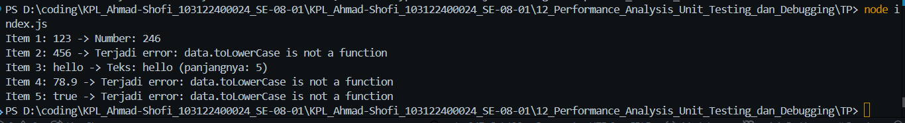

# Tugas Pendahuluan 11
## Menangkap Kecacatan Program Menggunakan Try Catch

**Nama:** Ahmad Shofi  
**NIM:** 103122400024  
**Kelas:** SE-08-01  

---

## Deskripsi Tugas

Pada tugas ini diminta untuk mencoba menangkap kecacatan atau error yang terdapat pada kode JavaScript. Program diberikan sebuah array berisi beberapa jenis data yang berbeda, seperti string, number, float, dan boolean.

Permasalahan muncul ketika program mencoba menjalankan method `toLowerCase()` pada semua data. Method `toLowerCase()` hanya dapat digunakan pada tipe data string. Jika method tersebut digunakan pada tipe data number atau boolean, maka program akan mengalami error.

Untuk mengatasi hal tersebut, digunakan blok `try catch` agar error dapat ditangkap dan program tetap berjalan sampai selesai.

---

## Kode Awal

Kode awal yang diberikan adalah sebagai berikut:

```javascript
function main() {
  const data = [
    "123",
    456,
    "hello",
    78.9,
    true,
  ];

  for (let i = 0; i < data.length; i++) {
    const result = processData(data[i]);
    console.log(`Item ${i + 1}: ${data[i]} -> ${result}`);
  }
}

function processData(data) {
  const str = data.toLowerCase();
  const num = parseInt(str);

  if (!isNaN(num) && str === String(num)) {
    return `Number: ${num * 2}`;
  }

  return `Teks: ${str} (panjangnya: ${str.length})`;
}

main();
```

---

## Permasalahan Program

Permasalahan pada program terdapat pada bagian berikut:

```javascript
const str = data.toLowerCase();
```

Kode tersebut akan berjalan dengan baik jika `data` bertipe string. Namun, pada array terdapat data dengan tipe lain seperti:

```javascript
456
78.9
true
```

Tipe data tersebut bukan string, sehingga tidak memiliki method `toLowerCase()`. Akibatnya, program akan menghasilkan error seperti berikut:

```text
TypeError: data.toLowerCase is not a function
```

Jika error tidak ditangani, maka program akan berhenti saat menemukan data yang tidak sesuai.

---

## Solusi

Solusi yang digunakan adalah menambahkan blok `try catch` pada bagian pemanggilan fungsi `processData()`.

Dengan menggunakan `try catch`, program dapat mencoba menjalankan kode di dalam blok `try`. Jika terjadi error, maka error tersebut akan ditangkap oleh blok `catch`, sehingga program tidak langsung berhenti.

---

## Kode Program Setelah Diperbaiki

### File `index.js`

```javascript
function main() {
  const data = [
    "123",
    456,
    "hello",
    78.9,
    true,
  ];

  for (let i = 0; i < data.length; i++) {
    try {
      const result = processData(data[i]);
      console.log(`Item ${i + 1}: ${data[i]} -> ${result}`);
    } catch (error) {
      console.log(`Item ${i + 1}: ${data[i]} -> Terjadi error: ${error.message}`);
    }
  }
}

function processData(data) {
  const str = data.toLowerCase();
  const num = parseInt(str);

  if (!isNaN(num) && str === String(num)) {
    return `Number: ${num * 2}`;
  }

  return `Teks: ${str} (panjangnya: ${str.length})`;
}

main();
```

---

## Penjelasan Kode

Pada fungsi `main()`, terdapat array bernama `data` yang berisi beberapa nilai dengan tipe data berbeda.

```javascript
const data = [
  "123",
  456,
  "hello",
  78.9,
  true,
];
```

Kemudian program melakukan perulangan untuk memproses setiap item dalam array tersebut.

```javascript
for (let i = 0; i < data.length; i++) {
```

Di dalam perulangan, fungsi `processData()` dipanggil untuk memproses setiap data.

```javascript
const result = processData(data[i]);
```

Namun, pemanggilan fungsi tersebut dimasukkan ke dalam blok `try`, sehingga jika terjadi error, program tidak langsung berhenti.

```javascript
try {
  const result = processData(data[i]);
  console.log(`Item ${i + 1}: ${data[i]} -> ${result}`);
}
```

Jika terjadi error, maka blok `catch` akan menangkap error tersebut dan menampilkan pesan error.

```javascript
catch (error) {
  console.log(`Item ${i + 1}: ${data[i]} -> Terjadi error: ${error.message}`);
}
```

Dengan cara ini, program tetap dapat melanjutkan proses ke data berikutnya meskipun ada data yang menyebabkan error.

---

## Cara Menjalankan Program

Langkah-langkah menjalankan program adalah sebagai berikut:

1. Buat file bernama `index.js`.
2. Masukkan kode program yang sudah diperbaiki.
3. Buka terminal pada folder tempat file berada.
4. Jalankan program dengan perintah:

```bash
node index.js
```

---

## Output Program

Output yang dihasilkan adalah sebagai berikut:

```text
Item 1: 123 -> Number: 246
Item 2: 456 -> Terjadi error: data.toLowerCase is not a function
Item 3: hello -> Teks: hello (panjangnya: 5)
Item 4: 78.9 -> Terjadi error: data.toLowerCase is not a function
Item 5: true -> Terjadi error: data.toLowerCase is not a function
```



---

## Analisis Output

Pada item pertama, data `"123"` merupakan string, sehingga dapat diproses oleh method `toLowerCase()`. Setelah itu, data tersebut dikenali sebagai angka dan hasilnya dikalikan dua menjadi `246`.

Pada item kedua, data `456` merupakan number. Tipe data number tidak memiliki method `toLowerCase()`, sehingga menghasilkan error. Error tersebut berhasil ditangkap oleh blok `catch`.

Pada item ketiga, data `"hello"` merupakan string, sehingga dapat diproses. Karena data tersebut bukan angka, maka program menampilkan teks beserta panjang karakternya.

Pada item keempat, data `78.9` merupakan number desimal. Data ini juga tidak memiliki method `toLowerCase()`, sehingga menghasilkan error dan ditangkap oleh blok `catch`.

Pada item kelima, data `true` merupakan boolean. Tipe data boolean juga tidak memiliki method `toLowerCase()`, sehingga menghasilkan error dan ditangkap oleh blok `catch`.

---

## Fitur Program

Program memiliki beberapa fitur utama sebagai berikut:

1. Memproses data dari array
2. Mengubah teks menjadi huruf kecil
3. Mengecek apakah data berupa angka dalam bentuk string
4. Mengalikan angka dengan nilai 2
5. Menampilkan panjang teks
6. Menangkap error menggunakan `try catch`
7. Program tetap berjalan meskipun terdapat data yang error

---

## Kesimpulan

Program berhasil diperbaiki dengan menambahkan mekanisme penanganan error menggunakan `try catch`. Error terjadi karena method `toLowerCase()` hanya dapat digunakan pada tipe data string, sedangkan array berisi beberapa tipe data lain seperti number dan boolean.

Dengan adanya `try catch`, error dapat ditangkap dan ditampilkan tanpa menghentikan jalannya program. Program tetap dapat memproses data berikutnya meskipun terdapat data yang menyebabkan error.

Keunggulan penggunaan `try catch` pada program ini adalah:

- Program tidak langsung berhenti saat terjadi error
- Error dapat diketahui dengan jelas
- Program menjadi lebih aman saat memproses berbagai tipe data
- Proses debugging menjadi lebih mudah

Dengan tugas ini, pemahaman mengenai penanganan kecacatan atau error dalam JavaScript menggunakan `try catch` menjadi lebih baik.